# thumbdeck — wireless split thumb keyboard for a phone

Turn a phone into a handheld work deck. The phone **MagSafe-mounts in the centre**;
two ergonomic grips flank it, and you **thumb-type on metal snap-dome keys** — a
full QWERTY split down the middle, like a [Rii i8+](references/rii8_ref.png) cut in
half and wrapped around a [Backbone](sketches/)-style controller. **One certified
nRF52840 module** in the right grip runs everything over **BLE**; the left grip is a
passive matrix wired across a fixed internal FFC bridge.

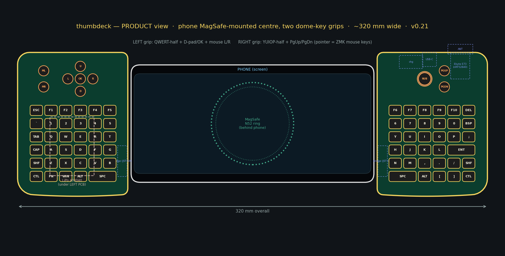

> **Status: rev-A (v0.16) — routed, DRC-clean, fab package generated; not yet
> built.** Both boards are **fully routed and DRC-clean** (0 violations, 0
> unconnected, KiCad 9), all parts are real LCSC-stocked SMT parts, the gerber +
> BOM + CPL package for JLCPCB is in
> [`hardware/kicad/generated/fab/`](hardware/kicad/generated/fab/), the CI
> workflow is a self-contained ZMK v0.3.0 build (**require one green Actions run
> producing `thumbdeck-zmk.uf2` before ordering boards** — no green run exists
> yet), and the 3D shells/keymats pass a real-geometry fit check.
> What it has **not** had is a physical prototype: order rev-A as a **first-article
> run of 5** and bring it up per [`docs/assembly.md`](docs/assembly.md) before any
> larger spend. Open ergonomic calls in §[Open questions](#open-questions).

---

## At a glance

| | value |
|---|---|
| Form | phone in **LANDSCAPE**, MagSafe-mounted centre, two dome-key grips, **fixed shell in 5 printed parts** (Steam-Deck-style; every part fits an Ender 3 V2 bed) |
| Keys | **79 Snaptron 7 mm snap domes** (right 37, left 42) · **9.5 mm** ortholinear pitch (~1.5 mm walls → PETG-printable) · one-piece living-hinge keymat with a **2u space bar**/side |
| Left grip | QWERT-half (6×6) + **4-way D-pad + OK** + **mouse L/R** buttons — fully passive (diodes + FFC only) |
| Right grip | YUIOP-half (6×6) + **PgUp/PgDn**, plus the module and the whole power front-end |
| Controller | **one Ebyte E73-2G4M08S1C** (nRF52840 module, JLC C356849) — certified radio, on-module antenna/crystals, UF2-flashable after a one-time SWD bootloader flash |
| Matrix | single **9 × 10**, `col2row`, one **SOD-323** diode/key on the back, 9× 4.7 kΩ row pull-downs, NKRO best-effort |
| Bridge | **16-pin 1.0 mm FFC ZIF** (JUSHUO AFA07-S16FCC-00, C13744) on each grip's inner edge + a **16-way 1.0 mm type-A (same-side contacts) FFC jumper, length ≥160 mm** (200 mm is the common stock length, e.g. "FFC-1.0-16P-200mm" type A) — nets assigned by ribbon geometry so a straight jumper is correct by construction |
| Grip boards | **76.5 × 114.5 mm** each, **4-layer** (sig / GND plane / sig / sig), 1.6 mm FR-4, **ENIG** (mandatory — dome contacts) |
| Power | **LiPo in the spine, behind the MagSafe ring**; **MCP73831** charger + **USB-C** + inline **USBLC6-2** ESD + **MSK12C02 power switch** + **reset tact** (pinhole) + **charge LED** in the right grip |
| Pointer | **no trackpad in v1** — D-pad + ZMK mouse keys on the FN layer; a labelled I²C breakout (TP6–8) keeps a rev-B trackpad possible |
| Wireless | BLE HID; USB-C for charging + UF2 flashing |
| Fabrication | **JLCPCB** turnkey, **two separate orders** (right + left), single-sided reflow (**all SMT on the back**, no hand-soldered parts — the USB-C shell's plated stakes and the FFC/slide-switch locating pegs are the only through-board features, all placed in the same single-pass JLC assembly) → rough target **~$150–250 for 5 sets** (re-quote at order time) |
| Firmware | **ZMK v0.3.0**, real board definition `thumbdeck` (unibody, not a split); the CI workflow is a **self-contained** ZMK v0.3.0 build — require one green Actions run producing `thumbdeck-zmk.uf2` before ordering boards |

> **Why a module, not chip-down:** a bare nRF52840 would force you to own a 2.4 GHz
> match + VNA tuning, **FCC/IC/RED radiated certification**, a USB bootloader,
> crystals, and a from-scratch Zephyr board port. A pre-certified module retires all
> of that and still breaks out far more GPIO than the 19 matrix pins + battery sense
> this design needs. We use the **Ebyte E73** because it's stocked in the JLCPCB
> library and machine-places — see
> [`docs/fabrication-sourcing.md`](docs/fabrication-sourcing.md). Full decision
> record in [`docs/design-decisions.md`](docs/design-decisions.md).

---

## The diagrams

Everything below is generated from one parametric model
([`hardware/scripts/deck.py`](hardware/scripts/deck.py)) — regenerate with the
[pipeline](#reproduce-the-design).

### Product view — the whole thing


Phone landscape in the centre on the MagSafe ring; left grip = QWERT half + D-pad/OK +
mouse buttons; right grip = YUIOP half + PgUp/PgDn, with the Ebyte module and power
front-end in the grip and the LiPo in the spine.

### Assembly layers — top of the stack → bottom

Five renders on an **identical canvas** (2400×1050) that overlay pixel-for-pixel or
flip through as an animation. Scrolling down peels the device from the front face to
the back. Generate with `python3 hardware/scripts/render_layers.py`.

**5 · Front layer** (2D concept; printed as 3 parts since v0.16 — two grip lids +
center panel) — key openings, phone pocket, screw holes, and the MagSafe N52 ring
seated in its recess.

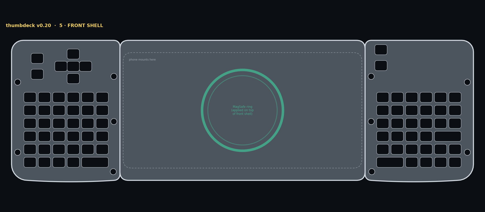

**4 · Keymats** — the one-piece printed keycaps joined by living-hinge strips.

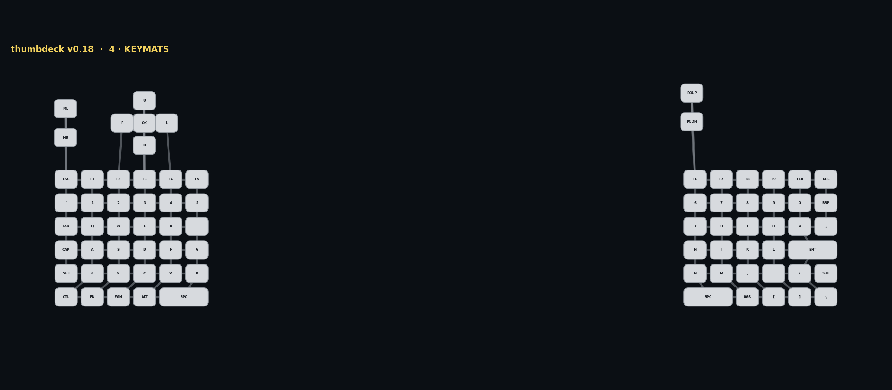

**3 · PCB front** — the snap-dome contact pads (centre pad + leg ring with the
routing escape gap) and the front-layer traces. The front carries **zero soldered
parts** — domes are pressed on later, under retention tape.

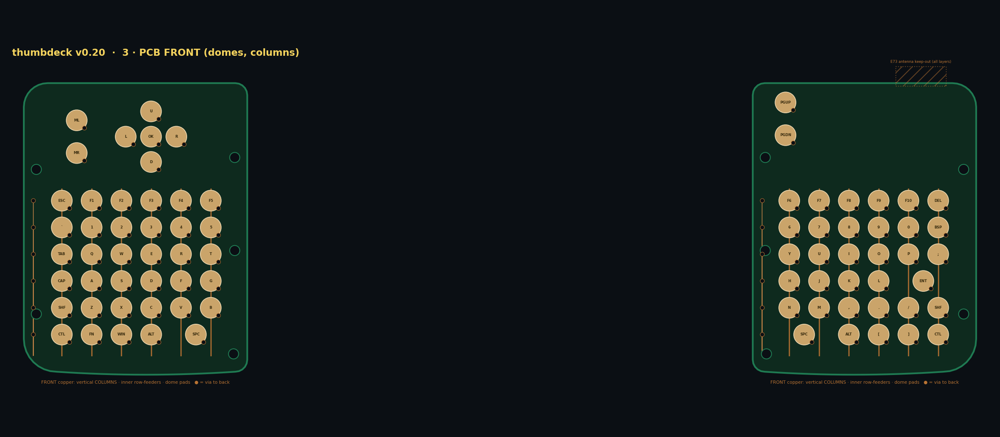

**2 · PCB back** — a diode behind every dome, the Ebyte module (antenna-down at the
bottom edge), charger, USB-C, ESD, power switch, reset tact, charge LED, FFC
connector, and all passives. Everything soldered lives here.

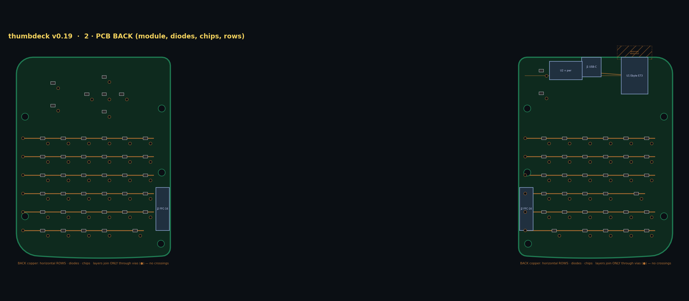

**1 · Back layer** (2D concept; printed as left/right halves since v0.16) — the
case, screw bosses, support posts under the key field, the MagSafe + LiPo pockets
in the spine, and the USB-C / power-switch / pinhole cutouts.

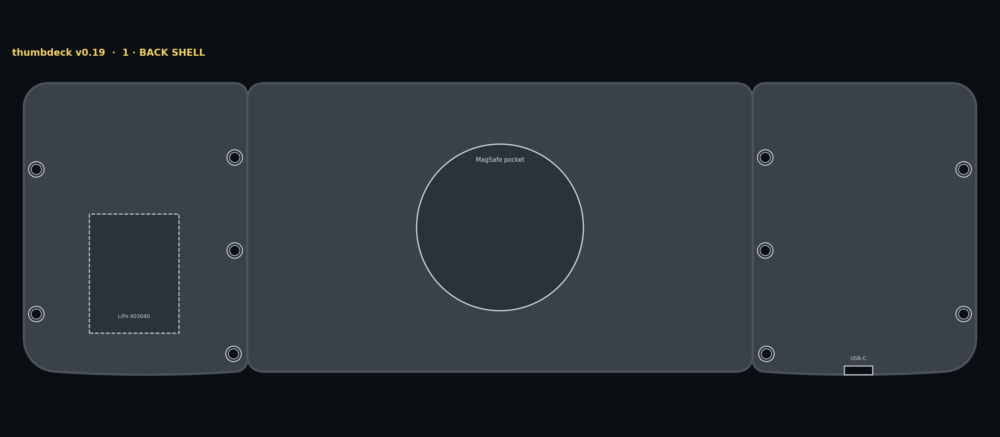

### Per-grip layout

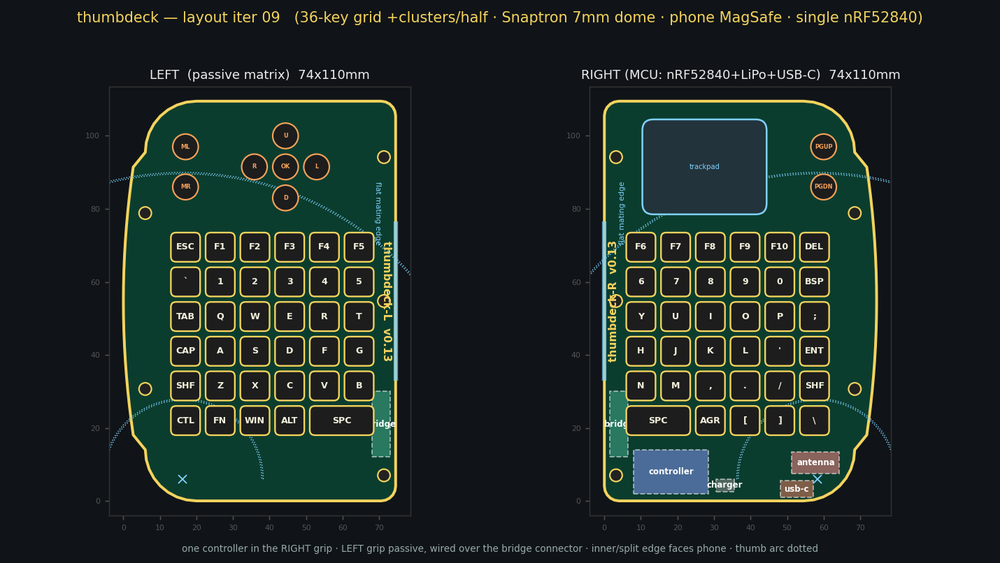

Ortholinear 6-col grid at 9.5 mm per grip (bottom row = a 2u space bar), plus the cluster features.

### Fabrication view + real KiCad boards

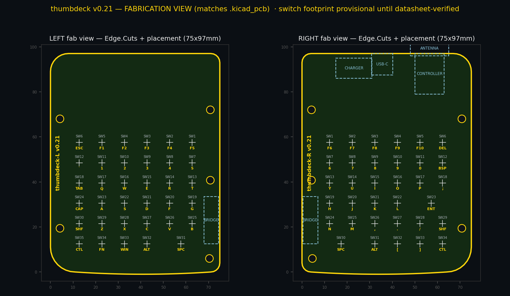

The generated boards are **real, routed, DRC-clean KiCad 9 files** —
[`hardware/kicad/generated/thumbdeck_right.kicad_pcb`](hardware/kicad/generated/thumbdeck_right.kicad_pcb)
(37 domes + 37 diodes + module + power front-end) and `thumbdeck_left.kicad_pcb`
(42 + 42, passive) — **0 DRC violations, 0 unconnected items** on both
(`kicad-cli 9.0.9`, error severity, verified 2026-07-11). The full fab package
(4-layer gerbers, JLC-format BOM + CPL) is already exported to
[`hardware/kicad/generated/fab/`](hardware/kicad/generated/fab/); the exporter
refuses to run unless DRC is clean. Routing is fully autonomous — Freerouting +
a GND stitcher + a DRC gate; see [`docs/routing-status.md`](docs/routing-status.md).

Like the i8+: the **front** carries only the snap-dome contact pads and front-layer
traces; the **back** carries everything soldered — the 79 diodes, the Ebyte module,
charger, USB-C, ESD, power switch, reset tact, charge LED, FFC connectors, passives.
All parts on one side makes the SMT job **single-sided** (one stencil, one pass) and
**100 % turnkey** — there are no hand-soldered parts. The USB-C shell's plated
stakes and the FFC/slide-switch locating pegs are the only through-board features,
and they are all placed in the same single-pass JLC assembly.

### 3D model — printable shells + keymats, fit-checked against real hardware

The mechanical parts are generated from the **same** parametric model as the PCB
([`hardware/scripts/deck.py`](hardware/scripts/deck.py)) via CadQuery, so key openings
land on dome pads and bosses land on mount holes *by construction*. The whole stack —
back halves, PCB with **real-dimension** components (E73 module, USB-C, connectors,
SOT-23s, 0402s, snap-domes), LiPo, FFC jumper, keymats, grip lids, center panel,
MagSafe ring, phone — is assembled in one frame and **collision-checked**:
`deck3d.py --check` reports **0 impossible overlaps**. Full method:
[`docs/cad-process.md`](docs/cad-process.md).

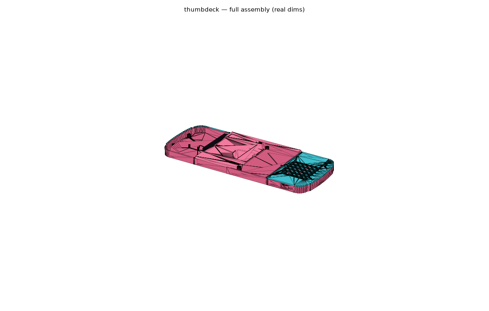

**Exploded** — back halves · PCB + domes · keymats · grip lids · center panel · MagSafe · phone:

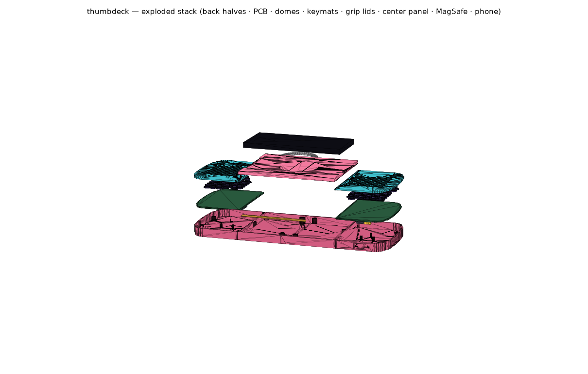

The shell is **five printed parts** (v0.16, per the concept sketches: cyan grip
lids, pink back + center panel), so everything prints flat on a **220 × 220 mm
Ender 3 V2 bed** — the old one-piece shells needed a 350-class printer. The two
back halves join at mid-spine with printed tabs + wall shiplaps (no seam screws);
the screwed-on center panel bridges that seam, carries the phone pocket + MagSafe
ring recess, and doubles as the **battery/FFC service hatch** (6 screws, grips
untouched). Per-grip keymats unchanged (plungers + living-hinge web, TPU 95A).

Back half | Grip lid | Center panel | Keymat
:---:|:---:|:---:|:---:
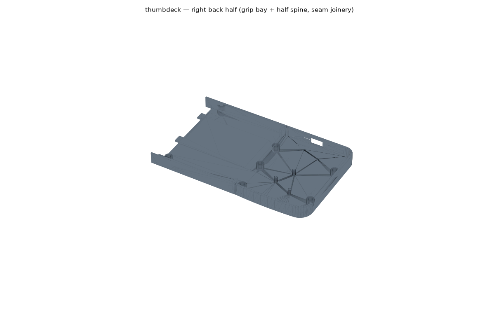 | 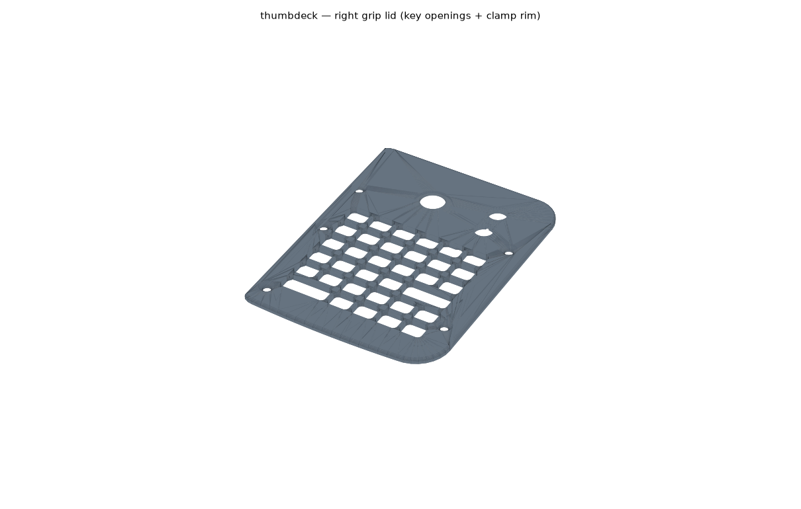 | 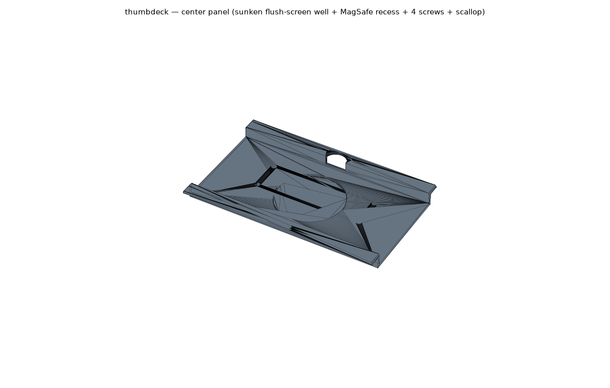 | 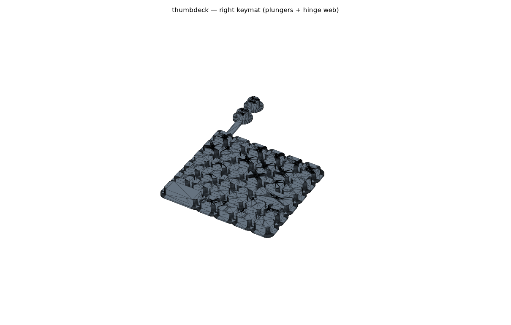

Regenerate: `hardware/cad/.venv/bin/python hardware/cad/deck3d.py --all --check --render`
(`--all` also gates every part on the Ender 3 V2 bed-fit; `--sync-models` refreshes
the tracked STLs in `hardware/cad/models/`).

---

## Parts list (BOM)

Full BOM in [`docs/bill-of-materials.md`](docs/bill-of-materials.md) — regenerated
from the machine-exported `fab/*/bom.csv`. **79 keys**, **one** module, **one**
battery. Everything soldered is placed by JLC; your hands do domes, shell, battery
and the FFC jumper.

### Core

| Item | Part | Qty | Notes |
|---|---|---|---|
| Snap dome | **Snaptron 7 mm 4-leg dome** (SnapForce series) | 79 (+spares) | Pressed onto ENIG contact pads under retention tape — no solder. Footprint: `snaptron_7mm_contact` (centre pad + leg ring with routing escape gap). |
| Dome retention | Snaptron taped polyimide array (Peel-N-Place) **or** 0.2–0.3 mm laser-cut polyimide spacer | 2 | **Required** — the keymat alone won't stop a dome walking off its contact ring. The tape channels also vent the domes. |
| Keymat | one-piece 3D print, **TPU 95A** / tough resin | 2 | Living-hinge strips; fatigue-test a coupon >10 k cycles before the full mat. |
| Diode | **1N4148WS SOD-323** (JLC **C2128**, Basic) | 79 | One/key, `col2row`, cathode band → row net, **on the back**. Basic part = free feeder. |
| **Controller** | **Ebyte E73-2G4M08S1C** (nRF52840, JLC **C356849**) | **1** | Certified radio, on-module antenna/crystals. On the **back** of the right grip, **antenna-down at the board edge**. Extended + X-ray + **volatile stock** (seen swinging ~1000 → ~20 units in days) — reserve/backorder before anything else. |
| **LiPo** | single cell ~400–700 mAh, JST-PH pigtail | 1 | In the spine behind the MagSafe ring. **Meter pigtail polarity against the "+"/"−" silk at J3 before first plug-in** — vendors wire PH pigtails both ways. |
| **Bridge** | **AFA07-S16FCC-00** 16-pin 1.0 mm FFC ZIF (C13744) ×2 + **16-way 1.0 mm type-A FFC jumper, length ≥160 mm** (200 mm is the common stock length, e.g. "FFC-1.0-16P-200mm" type A) | 1 set | Bottom-contact, 2.5 mm tall. Type-A (same-side contacts) is correct — the left grip's nets are assigned by ribbon geometry so a straight jumper matches 1:1. The J2 contact rows are 151.2 mm apart + ~4 mm ZIF insertion per end — a 150 mm ribbon cannot mate. |

### Power / USB front-end (right grip — required even with a module)

| Item | Part | Qty | Notes |
|---|---|---|---|
| Charger IC | **MCP73831T-2ACI/OT** (JLC **C424093**) | 1 | Module has no charger. PROG = 5.1 kΩ → ~196 mA (~0.5 C of a 400 mAh cell). Don't sub -2ATI (different Vreg). 4.7 µF 0805 at **both** VDD and VBAT per datasheet. |
| USB-C receptacle | **fully-SMD 16P** (JLC **C165948**) + **2× 5.1 kΩ** CC1/CC2 | 1 | Must be SMD — a THT shell breaks 100 % reflow. Missing CC = never charges. |
| ESD array | **USBLC6-2SC6** (JLC **C7519**) **inline** between USB-C and module | 1 | |
| Power switch | **MSK12C02** slide (C431540) between cell+ and VBAT | 1 | Charger stays on the cell side — it charges while switched off. Knob through a slot in the back-half wall. |
| Reset button | **TS-1187A** tact (C318884), top-actuated | 1 | Pressed through a 1.6 mm pinhole in the shell floor — UF2 double-tap without opening the shell. |
| Charge LED | 0603 red (C2286) + 1 kΩ | 1 | On MCP73831 STAT; visible through a 1.5 mm floor hole. |
| Battery connector | **JST-PH 2.0 mm side-entry SMT** (S2B-PH-SM4-TB, C295747) | 1 | Polarized; the hobby-LiPo standard. |
| Battery sense | 2× 1 MΩ divider (÷2) + 100 nF SAADC filter | 1 | On P0.02/AIN0. |
| SWD pads | **TP1–5** (SWDIO / SWDCLK / RESET / 3V3 / GND), silk-labelled | — | One-time bootloader flash / recovery. TP6–8 = spare I²C (SDA/SCL/INT) for a rev-B trackpad. |

### Matrix hardening (on the board)

| Item | Part | Qty | Notes |
|---|---|---|---|
| Row pull-downs | 4.7 kΩ 0402 (R1–R9) | 9 | External at the MCU — the nRF's internal pull is too weak over the ribbon. |

Column series resistors and a dome-field TVS were considered and **dropped** — the
bridge is a short fixed internal ribbon, not a long flexing cable. Note them as a
rev-B option if field ESD issues appear.

### PCB / hardware

| Item | Spec | Qty | Notes |
|---|---|---|---|
| PCB | `thumbdeck_right` + `thumbdeck_left`, **4-layer**, 1.6 mm FR-4, **ENIG** | 5 each | Two distinct boards, **two separate JLC orders**. Fab package pre-exported in `hardware/kicad/generated/fab/`. |
| Shell | 5 prints (2 back halves, 2 grip lids, center panel), **MagSafe N52 ring** in the panel recess | 1 | MagSafe = alignment; the phone pocket takes the load. All parts fit a 220 × 220 bed. |
| M2 hardware | **M2×10** screws + heat-set inserts (3.2 mm bores) | 16 | 5/grip + 6 on the center panel (4 seam + 2 ring-height). |

---

# Build guide

Path: **order boards (turnkey, no routing left to do) → press domes → print shells +
keymats → assemble + FFC jumper → battery → first flash → pair.** Full detail in
[`docs/assembly.md`](docs/assembly.md).

## Step 1 — Order the boards

Nothing is left to route: both boards are **DRC-clean and fully routed**, and the
JLCPCB package is already exported.

1. Upload `hardware/kicad/generated/fab/right/thumbdeck_right_gerbers.zip` +
   `bom.csv` + `positions.csv` as one JLCPCB PCBA order, and the `fab/left/` set as
   a **second, separate order** (two different designs — panelizing them costs more
   than it saves).
2. Options: **4-layer**, 1.6 mm FR-4, **ENIG** (snap domes need gold — HASL oxidises
   within weeks of cycling), assembly side = **bottom**, single-sided. The right
   board needs **Standard** assembly (the E73 is Extended + X-ray); the left board
   (42 diodes + one connector) can go Economic.
3. **Check the DFM preview before paying** — LED polarity (the classic JLC 180°
   flip), SOT-23-5/6 rotation, USB-C and E73 orientation. Rotate in the preview if
   needed.
4. Rough target **~$150–250 for 5 sets** — costing detail and part numbers in
   [`docs/fabrication-sourcing.md`](docs/fabrication-sourcing.md); re-quote at order
   time. **E73 stock is volatile** (observed from ~1000 down to ~20 units within
   days) — check jlcpcb.com/parts for **C356849** and **reserve/backorder the
   modules before anything else**.

## Step 2 — Domes, retention, keymat

- Press the **79 Snaptron domes** onto the gold pads under the **polyimide retention
  tape/array** (pockets locate each 7 mm dome; the tape channels vent them).
- Print the **shells** (PETG) and the **keymat** (TPU 95A); validate boss travel +
  hinge fatigue on a 3×3 coupon **before** committing the full mat.

## Step 3 — Assemble

- Everything soldered arrives soldered — there is **no hand-soldering step**.
- **FFC jumper first** (the ZIFs hide under the lids): ≥160 mm type-A ribbon
  (200 mm stock length) between the two ZIF connectors, **contacts facing the
  board at both ends** (bottom-contact ZIFs); flip the latches closed.
- Seat each board on its 3 support posts + perimeter bosses; screw on each grip
  lid (5 × M2×10), join the back halves (printed tabs + shiplaps, screwless),
  then the center panel last (6 × M2×10) — it splices the seam and is the
  battery/FFC service hatch. Full order: [`docs/assembly.md`](docs/assembly.md).
- **Battery:** meter the pigtail against the **"+"/"−" silk at J3** first (vendors
  wire PH pigtails both ways) — but **do not connect the cell until after the
  first flash** (REGOUT0 must be programmed first — see
  [`docs/assembly.md`](docs/assembly.md)). Slide switch OFF for assembly.

## Step 4 — First flash, pair

- The E73 ships **blank**. One-time step: SWD-flash the **Adafruit nRF52 bootloader
  (nice_nano build)** via TP1–5 (a `nrfjprog --recover` may be needed first). The
  bootloader sets REGOUT0 = 3.3 V.
- From then on it's UF2: double-tap reset (pinhole) → drag the CI-built
  `thumbdeck-zmk.uf2` on.
- **Pair:** host pairs to **"thumbdeck"** (no inter-half pairing). Type across both
  grips — a dead **column** on the left → suspect the ribbon seating; a dead **row**
  hits **both** grips (rows shared). Confirm battery % over BLE.

---

## How it works

```
  LEFT grip (passive)                        RIGHT grip (MCU)
  42 domes + diodes  ── 16-way FFC jumper ──  Ebyte E73 (nRF52840)  ⇄ phone (BLE HID)
  D-pad/OK, mouse       straight type-A       + charger + USB-C + power switch
  (no chip/battery)     ribbon                scans the whole 9×10 matrix
```

- **One matrix, not a split.** A single 9×10 matrix scanned by one module. Right grip
  = COL0–4 (local); left grip = COL5–9 (over the ribbon); ROW0–8 shared. This is a
  ZMK **unibody** board — *not* `CONFIG_ZMK_SPLIT`. [`docs/matrix-and-diodes.md`](docs/matrix-and-diodes.md).
- **GPIO:** 19 matrix pins + 1 battery ADC, plus a spare I²C (SDA/SCL/INT) broken out
  to test pads TP6–8 for a rev-B trackpad. COL9 sits on P0.04/AIN2 — the XTAL pins
  (P0.00/P0.01) are deliberately kept free.
- **Power all in the right grip:** cell → charger (cell side) → **power switch** →
  VBAT → the module's VDDH. Only logic signals cross the bridge.
- **Antenna:** the E73's ceramic antenna points **down, off the bottom board edge**,
  with an all-layer keep-out crossing the edge and a 0.6 mm relief in the shell wall.
  Expect the phone + hand to detune range somewhat.

**More docs:** [design decisions](docs/design-decisions.md) ·
[rev-A design review](docs/design-review.md) ·
[fabrication & sourcing](docs/fabrication-sourcing.md) ·
[connectivity & power](docs/connectivity-and-power.md) ·
[matrix & diodes](docs/matrix-and-diodes.md) · [assembly](docs/assembly.md) ·
[routing pipeline](docs/routing-status.md) ·
[i8+ reference notes](docs/reference-notes.md)

---

## Open questions

Decisions that are **yours to make** — they change the shape of the build:

1. **Feel.** Pitch is **9.5 mm** (PETG-printable walls + i8+ comfort). Still an open
   call: a flat ortho grid vs a **canted/fanned arc** to feel more like a
   controller — the arc is a keymat/standoff change, not a pitch change.
2. **Phone-fit window.** A fixed shell fits a **~15 mm width band** — effectively one
   phone family unless you add a stick-on MagSafe ring.
3. **Cell size** — sleep-managed runtime is weeks; a 400–500 mAh cell may pack better
   than 700 mAh. PROG is already sized for ~0.5 C of a 400 mAh cell.
4. **Shoulder buttons** for index fingers (offload thumb modifiers)? A rev-B matrix
   change.
5. **Trackpad** — dropped from v1 (single-maintainer ZMK driver + ATI tuning burden);
   the labelled I²C breakout (TP6–8) keeps a rev-B trackpad possible.

---

## Reproduce the design

```bash
cd hardware/scripts
python3 gen_board.py                  # placement + netlist + deterministic USB copper + GND escape vias
./route.sh right && ./route.sh left   # Freerouting autoroute -> GND stitch + zone fill -> DRC gate
python3 gen_fab.py                    # gerbers/BOM/CPL per side (refuses to export unless DRC-clean)
python3 sim_matrix.py                 # ghosting/NKRO proof (79 keys, 0 collisions) — FINAL PASS
python3 gen_firmware.py               # ZMK transform/keymap/gpio, generated from the model
python3 render_layers.py              # 5 stackable 2D layers  -> renders/layer_*.png
# --- 3D (CadQuery; see docs/cad-process.md) ---
cd ../.. && hardware/cad/.venv/bin/python hardware/cad/deck3d.py --all --check --render
```

Requires Python 3 + `matplotlib`; the board pipeline needs **KiCad 9** (`pcbnew`
Python module + `kicad-cli`) and a **Freerouting** jar (see
[`docs/routing-status.md`](docs/routing-status.md)); the 3D generator uses a venv
(`hardware/cad/requirements.txt`).
[`hardware/layout/keymat.json`](hardware/layout/keymat.json) is the **original
sketch digitization** — historical; the layout source of truth is now the `LEGENDS`
tables in `deck.py`. The old 50-key / nice!nano design-loop scripts are archived in
[`hardware/scripts/legacy/`](hardware/scripts/legacy/).

---

## License

MIT — see [LICENSE](LICENSE).
