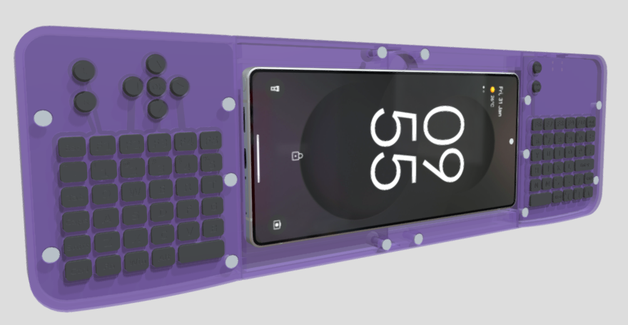
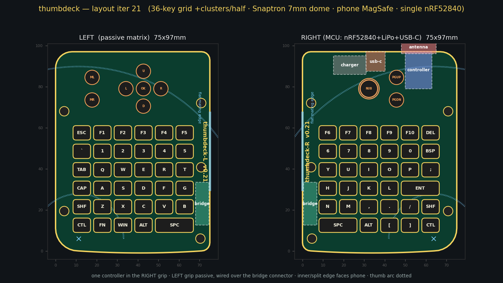
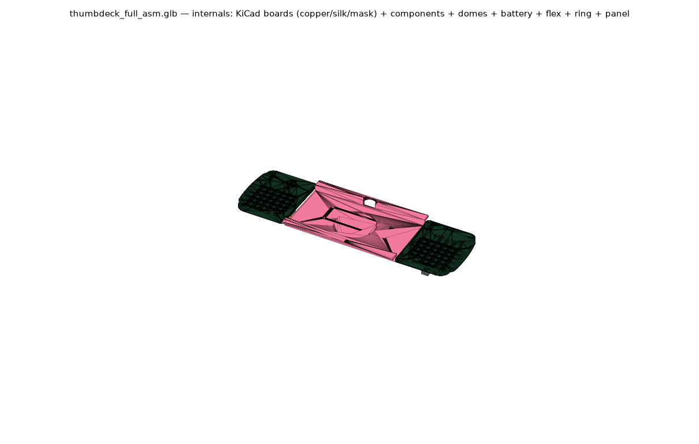

# Gripster

**A wireless split thumb keyboard that turns your phone into a handheld deck.** Your phone
MagSafe-mounts landscape in the middle, flush with the keyboard face; two grips flank it and you
thumb-type a real 78-key QWERTY on metal snap domes over Bluetooth.

[](https://sketchfab.com/3d-models/gripster-thumbdeck-6d42744a55e74e839ba6c28b54392279)

<sub>☝️ **This image is a link — click it to spin the real assembly in 3D on Sketchfab.**</sub>

[](LICENSE)


[](https://sketchfab.com/3d-models/gripster-thumbdeck-6d42744a55e74e839ba6c28b54392279)

> **Naming, once, so nothing is confusing later:** the project is called **Gripster** in prose. Every
> *internal* identifier — the ZMK board id `thumbdeck`, the board files `thumbdeck_right.kicad_pcb` /
> `thumbdeck_left.kicad_pcb`, the firmware artifact `thumbdeck-zmk.uf2`, the footprint library
> `thumbdeck.pretty/`, and the Bluetooth device name your phone will actually show — is
> **`thumbdeck`**. Those are real strings in real files and they stay as they are.

**What makes this interesting:**

- **The screen sits flush with the keys.** The phone drops into a sunken well so its glass and the
  keyboard face form one continuous plane 14.7 mm off the back — 15.7 mm thick overall. It is not a
  phone bolted on top of a keyboard.
- **No switches, no hand-soldering.** 78 Snaptron 7 mm metal snap domes press directly onto gold
  ENIG pads. Every soldered part is SMT on one side of each board — v0.21's pointing nub is a
  single SOT-23-6 hall sensor on the same reflow pass — so JLCPCB builds it 100 % turnkey,
  zero soldering by you.
- **It's not a split.** One certified nRF52840 module in the right grip scans a single 9×10 matrix;
  the left grip is fully passive, joined by one 16-way FFC ribbon. One BLE device, no half-to-half
  pairing, one battery, one firmware image.
- **The whole product is generated from one Python file.**
  [`hardware/scripts/deck.py`](hardware/scripts/deck.py) emits the KiCad boards, the CadQuery
  shells, the renders *and* the ZMK keymap — so key openings land on dome pads by construction, not
  by luck.
- **The boards are real and finished.** Both PCBs are fully autorouted and DRC-clean in KiCad 9
  (0 violations, 0 unconnected), with the JLCPCB gerber + BOM + CPL package exporting cleanly.

> ### ⚠️ Honest status: designed, not built
>
> **No physical Gripster has ever existed.** Every image *of this device* is a render or a generated
> layout — the only photographs in the repo are of the Rii i8+ that was studied as a reference
> ([`references/`](references/)), alongside the original hand drawings in [`sketches/`](sketches/).
> rev-A (v0.21) is complete on paper: both boards routed and DRC-clean, the fab package
> exports cleanly, all 9 printed parts watertight and bed-fit-checked for an Ender 3 V2. (CI is
> stale for v0.21 — re-run it; the last green build predates the nub module.) Nothing has been ordered, printed, pressed, flashed or typed on.
>
> **Unmeasured and unknown:** ergonomics, dome feel and dome life, BLE range with a phone
> centimetres away and a hand around the antenna, real battery life, and every print tolerance.
> "0 DRC violations" means *no rule was broken*, not *the circuit is correct*.
>
> If you build one, **you are building the first one**. Read
> [Project status & roadmap](#project-status--roadmap) before you spend money.

---

## Table of contents

- [What is this?](#what-is-this)
- [Where to start](#where-to-start)
  - [What's in the repo](#whats-in-the-repo)
  - [Which doc answers which question](#which-doc-answers-which-question)
- [Project status & roadmap](#project-status--roadmap)
  - [Done](#done) · [Not done](#not-done--read-this-before-spending-money) · [Roadmap](#roadmap) · [Open design calls](#open-design-calls) · [Version history](#version-history)
- [FAQ](#faq)
- [Hardware](#hardware)
  - [At a glance](#at-a-glance)
  - [Why a module, not chip-down](#why-a-module-not-chip-down)
  - [Product view](#product-view)
  - [Per-grip layout](#per-grip-layout)
  - [Assembly layers — front face to back](#assembly-layers--front-face-to-back)
  - [The 3D model — printable shells + keymats](#the-3d-model--printable-shells--keymats)
  - [Parts list (BOM)](#parts-list-bom)
- [Firmware & software](#firmware--software)
  - [How it works — matrix, GPIO, power, antenna](#how-it-works--matrix-gpio-power-antenna)
  - [Building the firmware](#building-the-firmware)
- [Build guide](#build-guide)
- [Design & generation (the parametric model)](#design--generation-the-parametric-model)
  - [Fabrication view + real KiCad boards](#fabrication-view--real-kicad-boards)
  - [Reproduce the design](#reproduce-the-design)
- [Contributing](#contributing)
- [License](#license)

---

## What is this?

Phones are the most capable computer most people carry and the worst thing to type on. Gripster is a
handheld shell that fixes the input half without replacing the phone: your phone stays the screen
and the compute, and the deck around it becomes the keyboard.

The phone mounts **landscape in the centre**, held by a MagSafe N52 ring and a moulded pocket, and it
sits **down inside a well** — deep enough that the glass and the keyboard face form a single flat
plane 14.7 mm off the back. Two contoured grips flank it. You hold it like a game controller and
thumb-type a full split QWERTY: 78 keys on **metal snap domes**, the same clicky stainless discs used
in TV remotes and the [Rii i8+](references/rii8_ref.png), pressed straight onto gold pads on the PCB.
There is no switch, no stem, no solder — the dome *is* the switch. The whole thing takes its design
language from a Game Boy Color: boxy rounded outline, translucent Atomic-Purple shell, dark-gray
keymats. The original concept drawings are in [`sketches/`](sketches/).

Despite the two halves, **this is not a split keyboard**. One certified nRF52840 module lives in the
right grip and scans everything; the left grip contains nothing but domes, diodes and a connector.

```
  LEFT grip (passive)                        RIGHT grip (MCU)
  42 domes + diodes  ── 16-way FFC jumper ──  Ebyte E73 (nRF52840)  ⇄ phone (BLE HID)
  D-pad/OK, mouse       straight type-A       + charger + USB-C + power switch
  (no chip)             ribbon                scans the whole 9×10 matrix
```

That means one Bluetooth device to pair, no half-to-half link to drop, one battery to charge, and one
firmware image. The cost is a ribbon cable running through the spine under the phone well.

Everything you can see in this repo — the KiCad boards, the printable shells, the renders above, even
the ZMK keymap — is generated from a single parametric Python model,
[`hardware/scripts/deck.py`](hardware/scripts/deck.py). Move a key in the model and the board pad,
the shell opening, the keycap and the firmware matrix transform all move with it.

---

## Where to start

**Just browsing?** Spin the
[3D model on Sketchfab](https://sketchfab.com/3d-models/gripster-thumbdeck-6d42744a55e74e839ba6c28b54392279),
then skim [At a glance](#at-a-glance) and the [FAQ](#faq).

**Thinking about building one?** Read [Project status & roadmap](#project-status--roadmap) first — it
will either talk you out of it or tell you exactly what you are signing up for — then
[`docs/assembly.md`](docs/assembly.md) and
[`docs/fabrication-sourcing.md`](docs/fabrication-sourcing.md).

**Here for the engineering?** [Fabrication view + real KiCad boards](#fabrication-view--real-kicad-boards),
[`docs/routing-status.md`](docs/routing-status.md) and
[`docs/design-decisions.md`](docs/design-decisions.md).

### What's in the repo

| Directory | What's in it |
|---|---|
| [`hardware/scripts/`](hardware/scripts/) | **The source of truth.** [`deck.py`](hardware/scripts/deck.py) is the parametric model; the rest generate boards, fab output, firmware, simulations and 2D renders from it. Old 50-key experiments are archived in [`legacy/`](hardware/scripts/legacy/). |
| [`hardware/kicad/`](hardware/kicad/) | The generated KiCad 9 boards. Nothing here is hand-drawn — see its [README](hardware/kicad/README.md). The JLCPCB fab package builds into `generated/fab/` (a local build artifact, not committed). |
| [`hardware/cad/`](hardware/cad/) | CadQuery 3D: [`deck3d.py`](hardware/cad/deck3d.py) builds the shells and keymats, [`export_full_asm.py`](hardware/cad/export_full_asm.py) builds the nested GLB. Watertight STLs live in [`models/`](hardware/cad/models/). |
| [`hardware/footprints/`](hardware/footprints/) | Custom KiCad footprints, including the [snap-dome contact pad](hardware/footprints/snaptron_7mm_contact_pad.kicad_mod). Some are vendored third-party — see [License](#license). |
| [`hardware/layout/`](hardware/layout/) | [`keymat.json`](hardware/layout/keymat.json), the original sketch digitization. Historical only; the live layout is the `LEGENDS` tables in `deck.py`. |
| [`firmware/zmk-config/`](firmware/zmk-config/) | ZMK v0.3.0 config with a real board definition ([`config/boards/arm/thumbdeck/`](firmware/zmk-config/config/boards/arm/thumbdeck/)) — a unibody board, not a shield, not a split. |
| [`docs/`](docs/) | Eleven engineering documents, plus [`docs/diagrams/`](docs/diagrams/). Table below. |
| [`renders/`](renders/) | Every image in this README, all generated. [`history/`](renders/history/) keeps the (superseded) iteration log. |
| [`sketches/`](sketches/) · [`references/`](references/) | The original concept drawings, and Rii i8+ reference photos used during the design. |
| [`.github/workflows/`](.github/workflows/) | The self-contained ZMK build that produces `thumbdeck-zmk.uf2`. |

### Which doc answers which question

| I want to know… | Read |
|---|---|
| Why is it built this way? Every decision, with rejected alternatives | [`docs/design-decisions.md`](docs/design-decisions.md) |
| How do I actually assemble one, in order, without bricking it? | [`docs/assembly.md`](docs/assembly.md) |
| What do I buy, from whom, for how much? | [`docs/fabrication-sourcing.md`](docs/fabrication-sourcing.md) · [`docs/bill-of-materials.md`](docs/bill-of-materials.md) |
| How does the 9×10 matrix work, and why one diode per key? | [`docs/matrix-and-diodes.md`](docs/matrix-and-diodes.md) |
| Battery, charging, USB, ESD, the FFC bridge | [`docs/connectivity-and-power.md`](docs/connectivity-and-power.md) |
| How does a Python file turn into a routed PCB? | [`docs/routing-status.md`](docs/routing-status.md) |
| How does a Python file turn into printable shells? | [`docs/cad-process.md`](docs/cad-process.md) |
| What would an EE tear apart in a review? | [`docs/design-review.md`](docs/design-review.md) · [`docs/evaluation.md`](docs/evaluation.md) |
| What did we learn from cutting up a Rii i8+? | [`docs/reference-notes.md`](docs/reference-notes.md) |
| What does the architecture look like as a diagram? | [`docs/diagrams/`](docs/diagrams/) |

---

## Project status & roadmap

**rev-A (v0.21). Designed to the point of being orderable. Never built.**

### Done

| | |
|---|---|
| Both PCBs | Fully placed and **autorouted**, **0 DRC violations / 0 unconnected items** (KiCad 9, `kicad-cli 9.0.9`, error severity; both boards re-routed and re-verified 2026-07-17 for the v0.19 outline, in the same commit that regenerated them) |
| Fab package | 4-layer gerbers + JLC-format BOM + CPL export cleanly to `hardware/kicad/generated/fab/` via `gen_fab.py`; the exporter refuses to run unless DRC is clean. (That directory is a build artifact and is **not committed** — regenerate it, see [Reproduce the design](#reproduce-the-design).) |
| BOM | Every part real, LCSC-stocked and machine-placeable; no hand-soldered components |
| 3D | 221 bodies assembled and collision-checked (`deck3d.py --check` → 0 impossible overlaps); all 7 shell parts (incl. the v0.21 nub spring + cap) + 2 keymats fit a 220 × 220 mm Ender 3 V2 bed (204 mm brim-safe limit) |
| Matrix proof | `sim_matrix.py` proves the full 78-key matrix is ghost-free with a diode per key |
| Firmware | Real ZMK v0.3.0 board definition; keymap and matrix transform generated from the model. CI last built green on 2026-07-15, **before the v0.21 nub module — re-run the workflow to validate v0.21**. Never flashed; no hardware exists. |

### Not done — read this before spending money

| | |
|---|---|
| **Physically built** | **Never.** Zero boards ordered, zero shells printed, zero domes pressed, zero flashes. Every image of the device is a render. |
| Ergonomics | The grip shape, key pitch and thumb reach have never been tested by a human hand. v0.19 already reshaped the grips once on print-test feedback — expect more. |
| Dome feel & life | Snaptron force curve, keymat living-hinge fatigue and dome retention are *specified* but unmeasured. Fatigue-test a 3×3 keymat coupon before printing a full one. |
| Circuit correctness | Autorouted and DRC-clean is not the same as reviewed. No board has been powered, and no net has been probed. |
| RF | The antenna sits centimetres from a phone and inside a closing hand. Range loss is expected and unquantified. |
| Battery life | Never measured. The ~450–500 mAh cell and ZMK's sleep behaviour suggest weeks of light use; treat that as an estimate, not a spec. |
| Tolerances | Boss travel, screw-boss fit and lid gaps have only been checked in CAD, never against a real print. |

### Roadmap

1. **First article.** Order 5 sets, print the shells, build one, and write down everything that is
   wrong.
2. **Bring-up.** SWD-flash the bootloader, load the UF2, prove the matrix grip-by-grip, measure
   current draw and BLE range with a phone in the well and a hand on the grips.
3. **rev-B**, driven by whatever the first article teaches. Already parked for it: shoulder buttons,
   a canted/fanned key arc, and an I²C trackpad on the TP6–8 breakout.

### Open design calls

Decisions that are **yours to make** — they change the shape of the build:

1. **Feel.** Keys are **rectangular 8.5 × 7 mm at 10 × 9 mm pitch** (v0.17, i8+ chiclet — wider than
   tall so the 6-row field stays short). Still an open call: a flat ortho grid vs a **canted/fanned
   arc** to feel more like a controller — the arc is a keymat/standoff change, not a pitch change.
2. **Phone-fit window.** The shell is now dimensioned to the **S25 Ultra + a 1.2 mm thin case**
   (v0.18 flush-screen well) — a different phone or a substantially different case needs
   `phone_w`/`phone_h`/`phone_t`/`case_t` re-set and the shells re-generated (one command; boards
   unaffected).
3. **Cell size — settled in v0.18:** standard **403040 (~450–500 mAh)** in the left grip cavity (the
   only standard shape that fits the 5.1 mm free depth there); PROG's 196 mA ≈ 0.43 C suits it as-is.
   Sleep-managed runtime is still weeks.
4. **Shoulder buttons** for index fingers (offload thumb modifiers)? A rev-B matrix change.
5. **Trackpad** — dropped from v1 (single-maintainer ZMK driver + ATI tuning burden); the labelled
   I²C breakout (TP6–8) keeps a rev-B trackpad possible.

### Version history

<details>
<summary><strong>v0.16 → v0.20 changelog</strong> (click to expand)</summary>

- **v0.16 — the shell splits.** The one-piece shells (which needed a 350-class printer) become
  **five printed parts**: two back halves joined at mid-spine with printed tabs + wall shiplaps (no
  seam screws), two grip lids, and a screwed-on center panel that bridges the seam. Everything now
  prints flat on a 220 × 220 mm Ender 3 V2 bed.
- **v0.16-follow (2026-07-15).** A **Rii-style 2u Enter** ends the right grip's H-row — `H J K L +
  ENT`. The `'` key gave up its spot (`'` is now **FN+`;`**), bringing the total to **78 keys**. The
  right board was regenerated and rerouted (still 0/0), the fab package re-exported, **debossed
  keycap legends** added to the keymat model, and the shell screws modelled in the 3D assembly.
- **v0.17 — Rii proportions.** The grips take the Rii i8+'s proportions: **97 mm** tall, a chin cut,
  the E73 + entire power front-end moved up into the **top zone** (the old trackpad space) with the
  ceramic antenna pointing **up off the top board edge**, and **rectangular 8.5 × 7 mm keys** at
  10 × 9 mm pitch replacing the round ones. Boards became 79.5 × 97.0 mm.
- **v0.18 — the phone sinks.** A real **S25 Ultra in a thin case** drops into a **well in the center
  panel** so its **screen surface is flush with the lids' keyboard face** — one 14.7 mm-high front
  plane, and the device drops from 22.9 mm to **15.7 mm** thick overall. That left no cell height in
  the spine, so the **battery moved to the left grip's cavity**: a standard **403040 (~450–500 mAh)**
  under the passive PCB. No board change, no reroute. The FFC minimum length rose accordingly.
- **v0.19 — Game Boy Color rework.** From print-testing feedback: the grip outline goes
  **GBC-boxy** — the parabolic outer cheek bow is deleted (it blocked thumb reach to the
  edge-adjacent keys) and boards narrow **79.5 → 75.0 mm**; corners tuck to r8 (top, antenna-pinned)
  and r11 + a 1.0 mm **crown** (bottom). All 14 face screws become **M3×10 countersunk, flush with
  the face**. The phone well gets **closing end walls** (no more open slots into the grips) and the
  thumb scallop becomes a **watertight curved finger dish**. Shells render and export in
  **translucent Atomic Purple** with dark-gray keymats. Both boards re-routed from scratch against
  the new outline, still 0 violations / 0 unconnected.
- **v0.20 — mirrored modifiers.** A thumb can't cross the phone gap, so Ctrl/Shift/Alt now exist on
  **both** grips: two right-grip caps relabel (`AltGr`→`Alt`, the corner `\`→`Ctrl`) and both grips
  end in the identical stack — Ctrl at the bottom-outside corner, Shift above it, Alt beside Space.
  `\` and `|` move to **FN+`]` / FN+`[`** (direct bindings). Right grip emits RCTRL/RSHFT/RALT.
  **No sticky keys — all chords are plain holds.** Zero PCB change: the matrix transform regenerated
  byte-identical; keymats re-debossed; `sim_matrix` re-run — 78 keys, 0 collisions, PASS.

</details>

---

## FAQ

**Will it fit my phone?**
Out of the box, no — the well is dimensioned for a **Samsung S25 Ultra (77.6 × 162.8 × 8.2 mm bare)
in a ~1.2 mm thin case**, and the fit is tight by design because the screen has to sit flush. But the
phone is four numbers in the model (`phone_w`, `phone_h`, `phone_t`, `case_t` in
[`hardware/scripts/deck.py`](hardware/scripts/deck.py)); change them, re-run the 3D generator, and
you get shells for your phone. **The PCBs are unaffected** — only the printed parts change. Two
caveats: your phone needs to support MagSafe or take a magnet ring, and the grip separation is
derived straight from the cased phone envelope — a substantially **larger** phone pushes the grips
further apart than is comfortable to thumb-type across (a smaller one brings them closer, which is
fine ergonomically, you just get less screen). A large change also moves the FFC bridge connectors
apart, so re-check the ribbon length in [`docs/assembly.md`](docs/assembly.md) before ordering.

**Can I build one today?**
You can order everything today — the boards are routed, DRC-clean and the JLCPCB package exports with
one command. But you would be building the **first one that has ever existed**, and rev-A has never
been electrically or ergonomically validated. If that is appealing,
[`docs/assembly.md`](docs/assembly.md) is written to be followed literally, and the one thing to
check first is E73 module stock (JLC **C356849**) — it has been observed swinging from ~1000 units to
~20 in days.

**Is it a split keyboard?**
It looks like one and isn't. There is a **single 9×10 matrix** scanned by one MCU: the right grip
owns COL0–4 locally, the left grip's COL5–9 arrive over a 16-way FFC ribbon, and all nine rows are
shared. In ZMK terms it's a **unibody board**, not `CONFIG_ZMK_SPLIT`. One device pairs to your
phone, one battery, one firmware. A useful debugging consequence: a dead **column** on the left
points at the ribbon; a dead **row** kills the same row on *both* grips.

**Why a module instead of a bare nRF52840?**
Because chip-down means owning a 2.4 GHz impedance match and VNA tuning, **FCC/IC/RED radiated
certification**, crystals, a USB bootloader and a from-scratch Zephyr board port. The Ebyte
E73-2G4M08S1C retires all of that, is stocked in JLCPCB's library so it machine-places, and still
breaks out far more GPIO than the 19 matrix pins + 1 battery ADC this design uses. Full reasoning in
[`docs/design-decisions.md`](docs/design-decisions.md) and
[below](#why-a-module-not-chip-down).

**Why no trackpad?**
It was designed in and then deliberately **cut from v1**: a maintained ZMK driver plus ATI/sensitivity
tuning is a large burden for a single maintainer, and it competed for the exact board area the module
and power front-end now occupy. Pointing since v0.21 is the right-grip **hall-effect nub**
(rate-control, ThinkPad-style) — which now lives on the very I²C breakout (**TP6–8**) that was
reserved for a rev-B trackpad — plus the left D-pad with FN-layer mouse keys as fallback. And the
user verdict behind the nub choice: trackpad-style thumb pointing means constantly lifting the
finger; a velocity-controlled nub doesn't.

**What's the battery life?**
Unknown — nothing has been measured. The design carries a standard **403040 LiPo (~450–500 mAh)** in
the left grip, charged at ~196 mA by an MCP73831, with battery percentage reported over BLE. A BLE HID
keyboard with a sleeping nRF52840 should give weeks of light use; that is an expectation based on
comparable ZMK builds, not a number from this device.

**Why ZMK and not QMK?**
ZMK is built around BLE and low-power sleep on nRF52 parts, which is exactly this device's whole job,
and it gives layers, combos and mouse keys for free. The repo pins **ZMK v0.3.0** (the last
HWMv1-compatible release, Zephyr 3.5) and ships a **real board definition** at
[`firmware/zmk-config/config/boards/arm/thumbdeck/`](firmware/zmk-config/config/boards/arm/thumbdeck/)
rather than a shield — the keymap and matrix transform are generated from the same model as the PCB,
so they cannot drift apart.

**What printer do I need?**
Anything with a **220 × 220 mm bed** — the 5-part shell split exists specifically so everything fits
an Ender 3 V2, and `deck3d.py --all` gates every part against a 204 mm brim-safe limit. Largest part
is a back half at 170.5 × 103.8 mm. Shells print in **PETG**; the keymats need **TPU 95A** (or a
tough resin) for the living hinges.

**Do I have to solder?**
No. Every soldered component is on one side of each board and is placed by JLCPCB, 100 % turnkey.
Your hands do four things: press the 78 domes onto their pads under retention tape, seat the FFC
ribbon, print and screw together the shell, and tape in the battery. The one unavoidable exception is
a **one-time SWD flash** of the Adafruit nRF52 bootloader via test pads TP1–5 (possibly preceded by
`nrfjprog --recover`) — that needs a debug probe, and it is the single most likely place a builder
gets stuck. After that it's drag-and-drop UF2 forever.

**What will it cost?**
The **~$150–250 for 5 sets** figure quoted below is **boards + JLCPCB assembly only**. It excludes
domes, retention tape, the LiPo, FFC jumpers, MagSafe rings, M3 hardware, filament, a debug probe,
shipping and any import duty. Re-quote at order time.

**Can I buy one?**
No. This is an open-source design, not a product — there is no kit, no store and no waiting list.
It's Apache 2.0, so you are free to build it, modify it or sell it yourself.

---

## Hardware

### At a glance

| | value |
|---|---|
| Form | phone (**S25 Ultra + thin case**) in **LANDSCAPE**, MagSafe-seated in a **sunken well — screen flush with the keyboard face** (14.7 mm front plane, 15.7 mm max thickness); two dome-key grips, **fixed shell in 5 printed parts** in **Game-Boy-Color design language** (v0.19: boxy rounded-corner outline, translucent Atomic-Purple shells, dark-gray keymats; every part fits an Ender 3 V2 bed) |
| Keys | **78 Snaptron 7 mm snap domes** (right 36, left 42) · **rectangular 8.5 × 7 mm keys** (i8+ chiclet feel) at **10 × 9 mm** pitch (~1.5–2 mm walls → PETG-printable) · one-piece living-hinge keymat with a **2u space bar**/side + a Rii-style **2u Enter** ending the right H-row · debossed keycap legends |
| Left grip | QWERT-half (6×6) + **4-way D-pad + OK** + **mouse L/R** buttons — fully passive (diodes + FFC only) |
| Right grip | YUIOP-half (6×6 field; the H-row ends in a Rii-style **2u ENT** — `H J K L + ENT`, with `'` on FN+`;`) + the v0.21 **pointing cluster mirroring the left D-pad cluster** (hall-effect nub at the D-pad mirror, PgUp/PgDn as the mouse-button pair's mirror), plus the module and the whole power front-end |
| Modifiers | **mirrored** (v0.20): Ctrl at each grip's bottom-outside corner, Shift directly above it, Alt beside each Space — a thumb can't cross the phone gap, so every mod+same-side-key chord holds the mod with the opposite thumb (right emits RCTRL/RSHFT/RALT). `\` and `\|` moved to FN+`]` / FN+`[`; **no sticky keys — all chords are plain holds** |
| Controller | **one Ebyte E73-2G4M08S1C** (nRF52840 module, JLC C356849) — certified radio, on-module antenna/crystals, UF2-flashable after a one-time SWD bootloader flash |
| Matrix | single **9 × 10**, `col2row`, one **SOD-323** diode/key on the back, 9× 4.7 kΩ row pull-downs, NKRO best-effort |
| Bridge | **16-pin 1.0 mm FFC ZIF** (JUSHUO AFA07-S16FCC-00, C13744) on each grip's inner edge + a **16-way 1.0 mm type-A (same-side contacts) FFC jumper, length ≥194 mm** (200 mm is the common stock length, e.g. "FFC-1.0-16P-200mm" type A; the S25U spine, v0.19's well end-walls and the under-well floor channel raised the minimum from 160) — nets assigned by ribbon geometry so a straight jumper is correct by construction |
| Grip boards | **75.0 × 97.0 mm** each (v0.19: GBC-boxy straight outer edge — the parabolic cheek bow is gone for thumb reach), **4-layer** (sig / GND plane / sig / sig), 1.6 mm FR-4, **ENIG** (mandatory — dome contacts) |
| Power | **LiPo 403040 (4.0 × 30 × 40, ~450–500 mAh) in the LEFT grip cavity** under the passive PCB (v0.18 — the sunken phone well leaves no cell height in the spine); **MCP73831** charger + **USB-C** + inline **USBLC6-2** ESD + **MSK12C02 power switch** + **reset tact** (pinhole) + **charge LED** in the right grip |
| Pointer | v0.21/22: **ThinkPad-style hall-effect nub** on the right grip, Ploopy-Bean architecture — a TMAG5273 I²C hall sensor (SOT-23-6, machine-placed) reads a magnet in a printed flexure spring **through the PCB**; true **rate-control** firmware (deflection → cursor velocity, quadratic curve) in an in-tree Zephyr module on the repurposed TP6–8 I²C breakout. The mount is a **standard 4.4 mm-square TrackPoint platform**: wear the printed **red soft-dome replica** or any **genuine classic TrackPoint cap**. FN+D-pad mouse keys remain as fallback |
| Wireless | BLE HID; USB-C for charging + UF2 flashing |
| Fabrication | **JLCPCB** turnkey, **two separate orders** (right + left), single-sided reflow (**all SMT on the back**, single-pass — v0.21 adds no THT) → rough target **~$150–250 for 5 sets**, boards + assembly only (re-quote at order time) |
| Firmware | **ZMK v0.3.0**, real board definition `thumbdeck` (unibody, not a split); the CI workflow is a **self-contained** ZMK v0.3.0 build producing `thumbdeck-zmk.uf2` |

### Why a module, not chip-down

> A bare nRF52840 would force you to own a 2.4 GHz match + VNA tuning, **FCC/IC/RED radiated
> certification**, a USB bootloader, crystals, and a from-scratch Zephyr board port. A pre-certified
> module retires all of that and still breaks out far more GPIO than the 19 matrix pins + battery
> sense this design needs. We use the **Ebyte E73** because it's stocked in the JLCPCB library and
> machine-places — see [`docs/fabrication-sourcing.md`](docs/fabrication-sourcing.md). Full decision
> record in [`docs/design-decisions.md`](docs/design-decisions.md).

Everything below is generated from one parametric model
([`hardware/scripts/deck.py`](hardware/scripts/deck.py)) — regenerate with the
[pipeline](#reproduce-the-design).

### Product view


Phone landscape in the centre on the MagSafe ring; left grip = QWERT half + D-pad/OK + mouse buttons;
right grip = YUIOP half + PgUp/PgDn, with the Ebyte module and power front-end in the grip and the
LiPo 403040 under the LEFT grip's PCB (v0.18 — the flush-screen phone well displaced it from the
spine).

### Per-grip layout



6-col grid of rectangular 8.5 × 7 mm keys at 10 × 9 mm pitch per grip (bottom row = a 2u space bar;
the right H-row ends in a Rii-style 2u Enter — `H J K L + ENT`, `'` on FN+`;`), plus the cluster
features. The E73 + power front-end sit in the top zone with the antenna up off the top edge;
PgUp/PgDn sit beside the pointing nub as the mouse-button pair's mirror (v0.21).

### Assembly layers — front face to back

Five renders on an **identical canvas** (2400×1050) that overlay pixel-for-pixel or flip through as
an animation. Scrolling down peels the device from the front face to the back. Generate with
`python3 hardware/scripts/render_layers.py`.

<details>
<summary><strong>Show all five layers</strong> (click to expand)</summary>

**5 · Front layer** (2D concept; printed as 3 parts since v0.16 — two grip lids + center panel) —
key openings, phone pocket, screw holes, and the MagSafe N52 ring seated in its recess.


**4 · Keymats** — the one-piece printed keycaps joined by living-hinge strips.


**3 · PCB front** — the snap-dome contact pads (centre pad + leg ring with the routing escape gap)
and the front-layer traces. The front carries **zero soldered parts** — domes are pressed on later,
under retention tape.


**2 · PCB back** — a diode behind every dome, the Ebyte module (**antenna-up at the top edge**,
v0.17), charger, USB-C, ESD, power switch, reset tact, charge LED, FFC connector, and all passives.
Everything soldered lives here — the whole cluster now sits in the top zone (the old trackpad space)
so the chin could be trimmed.


**1 · Back layer** (2D concept; printed as left/right halves since v0.16) — the case, screw bosses,
support posts under the key field, the LiPo bay in the LEFT grip, the FFC floor channel + MagSafe
well in the spine, and the USB-C / power-switch / pinhole cutouts.


</details>

### The 3D model — printable shells + keymats

Fit-checked in CAD against real-dimension component models — datasheet heights, not a physical
build. The mechanical parts are generated from the **same** parametric
model as the PCB ([`hardware/scripts/deck.py`](hardware/scripts/deck.py)) via CadQuery, so key
openings land on dome pads and bosses land on mount holes *by construction*. The whole stack — back
halves, PCB with **real-dimension** components (E73 module, USB-C, connectors, SOT-23s, 0402s,
snap-domes), LiPo, FFC jumper, keymats, grip lids, center panel, MagSafe ring, phone — is assembled
in one frame and **collision-checked**: `deck3d.py --check` reports **0 impossible overlaps**. Full
method: [`docs/cad-process.md`](docs/cad-process.md).


**Exploded** — back halves · PCB + domes · keymats · grip lids · center panel · MagSafe · phone:


The shell is **five printed parts** (v0.16 split, v0.17 proportions — cyan grip lids, pink back +
center panel per the concept sketches), so everything prints flat on a **220 × 220 mm Ender 3 V2
bed** — the old one-piece shells needed a 350-class printer. The two back halves join at mid-spine
with printed tabs + wall shiplaps (no seam screws); the screwed-on center panel bridges that seam,
carries the phone pocket + MagSafe ring recess, and doubles as the **FFC service hatch** (4 face
screws, grips untouched; since v0.18 the battery is serviced through the left grip instead). v0.17
keymats carry the **rectangular keycaps** (8.5 × 7 rounded-rect plungers, 18.5 mm 2u caps for the
space bars and the right H-row's Rii-style Enter, round cluster keys) on the same living-hinge web
(TPU 95A), now with **debossed Rii-style legends** (primary, shifted-symbol and FN-layer); the grip
lids get matching rounded-rect openings.
Part sizes: back halves 170.5/162.8 × 103.8 mm, grip lids 77.9 × 103.8, center panel
169.1 × 102.8, keymats ~63 × 86–89 — all within the 204 mm brim-safe limit.

Back half | Grip lid | Center panel | Keymat
:---:|:---:|:---:|:---:
 |  |  | 

Regenerate: `hardware/cad/.venv/bin/python hardware/cad/deck3d.py --all --check --render`
(`--all` also gates every part on the Ender 3 V2 bed-fit; `--sync-models` refreshes the tracked STLs
in [`hardware/cad/models/`](hardware/cad/models/)).

**Full nested assembly** —
[`hardware/cad/models/thumbdeck_full_asm.glb`](hardware/cad/models/thumbdeck_full_asm.glb) is the
whole build as one glTF file with a **named object tree** (open it in Blender or any glTF viewer, or
[spin it on Sketchfab](https://sketchfab.com/3d-models/gripster-thumbdeck-6d42744a55e74e839ba6c28b54392279)
— that model is this file): translucent **Atomic-Purple** shells + dark-gray keymats (real glTF PBR
materials), **KiCad-generated boards** (real Edge.Cuts body + routed copper + soldermask + silkscreen
from the `.kicad_pcb`s), every placed component and snap dome as its real-dimension body, plus the
403040 battery, FFC jumper (in its floor channel), the M3 shell screws, MagSafe ring and the
flush-mounted cased phone. All transforms are baked into the vertices, so the tree survives even
minimal TRS-only viewers. Regenerate:
`hardware/cad/.venv/bin/python hardware/cad/export_full_asm.py`.



### Parts list (BOM)

Full BOM in [`docs/bill-of-materials.md`](docs/bill-of-materials.md) — regenerated from the
machine-exported `fab/*/bom.csv`. **78 keys**, **one** module, **one** battery. Everything soldered is
placed by JLC; your hands do domes, shell, battery and the FFC jumper.

#### Core

| Item | Part | Qty | Notes |
|---|---|---|---|
| Snap dome | **Snaptron 7 mm 4-leg dome** (SnapForce series) | 78 (+spares) | Pressed onto ENIG contact pads under retention tape — no solder. Footprint: [`snaptron_7mm_contact`](hardware/footprints/snaptron_7mm_contact_pad.kicad_mod) (centre pad + leg ring with routing escape gap). |
| Dome retention | Snaptron taped polyimide array (Peel-N-Place) **or** 0.2–0.3 mm laser-cut polyimide spacer | 2 | **Required** — the keymat alone won't stop a dome walking off its contact ring. The tape channels also vent the domes. |
| Keymat | one-piece 3D print, **TPU 95A** / tough resin | 2 | Living-hinge strips; fatigue-test a coupon >10 k cycles before the full mat. |
| Diode | **1N4148WS SOD-323** (JLC **C2128**, Basic) | 78 | One/key, `col2row`, cathode band → row net, **on the back**. Basic part = free feeder. |
| **Controller** | **Ebyte E73-2G4M08S1C** (nRF52840, JLC **C356849**) | **1** | Certified radio, on-module antenna/crystals. On the **back** of the right grip, **antenna-up at the top board edge** (v0.17 — farthest from the centred phone/LiPo, off the edge the palm doesn't cradle). Extended + X-ray + **volatile stock** (seen swinging ~1000 → ~20 units in days) — reserve/backorder before anything else. |
| **LiPo** | **403040 pouch (4.0 × 30 × 40 mm, ~450–500 mAh)**, JST-PH pigtail | 1 | v0.18: foam-taped (0.3 mm) to the **LEFT grip's floor under the passive PCB** — the sunken phone well displaced it from the spine. Leads cross the spine's bottom-border lane to J3 on the right board. **Meter pigtail polarity against the "+"/"−" silk at J3 before first plug-in** — vendors wire PH pigtails both ways. |
| **Bridge** | **AFA07-S16FCC-00** 16-pin 1.0 mm FFC ZIF (C13744) ×2 + **16-way 1.0 mm type-A FFC jumper, length ≥194 mm** (200 mm is the common stock length, e.g. "FFC-1.0-16P-200mm" type A) | 1 set | Bottom-contact, 2.5 mm tall. Type-A (same-side contacts) is correct — the left grip's nets are assigned by ribbon geometry so a straight jumper matches 1:1. v0.19: the J2 contact rows are **173.3 mm** apart + ~4 mm ZIF insertion per end + two S-bends down into the under-well floor channel — 200 mm stock has ~6 mm slack; shorter ribbons cannot mate. |

#### Power / USB front-end (right grip — required even with a module)

| Item | Part | Qty | Notes |
|---|---|---|---|
| Charger IC | **MCP73831T-2ACI/OT** (JLC **C424093**) | 1 | Module has no charger. PROG = 5.1 kΩ → ~196 mA (~0.43 C of the 403040 cell). Don't sub -2ATI (different Vreg). 4.7 µF 0805 at **both** VDD and VBAT per datasheet. |
| USB-C receptacle | **fully-SMD 16P** (JLC **C165948**) + **2× 5.1 kΩ** CC1/CC2 | 1 | Must be SMD — a THT shell breaks 100 % reflow. Missing CC = never charges. |
| ESD array | **USBLC6-2SC6** (JLC **C7519**) **inline** between USB-C and module | 1 | |
| Power switch | **MSK12C02** slide (C431540) between cell+ and VBAT | 1 | Charger stays on the cell side — it charges while switched off. Knob through a slot in the **top** shell wall (v0.17 moved the electronics cluster to the top zone). |
| Reset button | **TS-1187A** tact (C318884), top-actuated | 1 | Pressed through a 1.6 mm pinhole in the shell floor — UF2 double-tap without opening the shell. |
| Charge LED | 0603 red (C2286) + 1 kΩ | 1 | On MCP73831 STAT; visible through a 1.5 mm floor hole. |
| Battery connector | **JST-PH 2.0 mm side-entry SMT** (S2B-PH-SM4-TB, C295747) | 1 | Polarized; the hobby-LiPo standard. |
| Battery sense | 2× 1 MΩ divider (÷2) + 100 nF SAADC filter | 1 | On P0.02/AIN0. |
| SWD pads | **TP1–5** (SWDIO / SWDCLK / RESET / 3V3 / GND), silk-labelled | — | One-time bootloader flash / recovery. TP6–8 = the nub sensor's live I²C (SDA/SCL/INT), still probe-able. |

#### Matrix hardening (on the board)

| Item | Part | Qty | Notes |
|---|---|---|---|
| Row pull-downs | 4.7 kΩ 0402 (R1–R9) | 9 | External at the MCU — the nRF's internal pull is too weak over the ribbon. |

Column series resistors and a dome-field TVS were considered and **dropped** — the bridge is a short
fixed internal ribbon, not a long flexing cable. Note them as a rev-B option if field ESD issues
appear.

#### PCB / hardware

| Item | Spec | Qty | Notes |
|---|---|---|---|
| PCB | `thumbdeck_right` + `thumbdeck_left`, **4-layer**, 1.6 mm FR-4, **ENIG** | 5 each | Two distinct boards, **two separate JLC orders**. Fab package exported by `gen_fab.py` into `hardware/kicad/generated/fab/`. |
| Shell | 7 prints (2 back halves, 2 grip lids, center panel, v0.21 nub spring + cap), **MagSafe N52 ring** in the panel recess | 1 | MagSafe = alignment; the phone pocket takes the load. All parts fit a 220 × 220 bed. |
| Pointing nub | **TMAG5273A1** hall sensor (C3716049, on the right board) + **Ø4 × 2 mm N52 disc magnet** in the printed spring | 1 + spare magnets | v0.21: the only added electronics is one SOT-23-6 — machine-placed with everything else. v0.22: the spring's post is a standard TrackPoint square platform — genuine classic caps fit; a red soft-dome replica prints in TPU. |
| M3 hardware | **M3×10 countersunk** screws + M3 heat-set inserts (Ø4.0 bores) | 14 | Heads flush with the face (v0.19). 5/grip + 4 on the center panel border; detach load goes to the border screws + slab stiffness. |

---

## Firmware & software

### How it works — matrix, GPIO, power, antenna

- **One matrix, not a split.** A single 9×10 matrix scanned by one module. Right grip = COL0–4
  (local); left grip = COL5–9 (over the ribbon); ROW0–8 shared. This is a ZMK **unibody** board —
  *not* `CONFIG_ZMK_SPLIT`. [`docs/matrix-and-diodes.md`](docs/matrix-and-diodes.md).
- **GPIO:** 19 matrix pins + 1 battery ADC, plus a spare I²C (SDA/SCL/INT) broken out to test pads
  TP6–8 for a rev-B trackpad. COL9 sits on P0.04/AIN2 — the XTAL pins (P0.00/P0.01) are deliberately
  kept free.
- **Power electronics all in the right grip:** cell → charger (cell side) → **power switch** → VBAT →
  the module's VDDH. Only logic signals cross the FFC bridge; the cell itself sits in the LEFT grip
  (v0.18) with its two DC leads crossing the spine's bottom-border lane to J3.
- **Antenna:** the E73's ceramic antenna points **up, off the top board edge** (v0.17 — centre-top,
  farthest from the phone/LiPo and off the edge the palm doesn't cradle), with an all-layer keep-out
  crossing the edge and a 0.6 mm relief in the shell wall. Expect the phone + hand to detune range
  somewhat; re-check on the first article.

A block diagram lives in [`docs/diagrams/`](docs/diagrams/). Every other document is indexed in
[Which doc answers which question](#which-doc-answers-which-question).

### Building the firmware

- **Config:** [`firmware/zmk-config/`](firmware/zmk-config/), pinned to **ZMK v0.3.0** — the last
  HWMv1-compatible release (Zephyr 3.5).
- **Board, not shield:** [`config/boards/arm/thumbdeck/`](firmware/zmk-config/config/boards/arm/thumbdeck/)
  is a real ZMK board definition (`thumbdeck.dts`, `thumbdeck.keymap`, `thumbdeck_defconfig`, …)
  describing a **unibody** keyboard. The matrix transform and keymap in there are *generated* by
  `gen_firmware.py` from the same model as the PCB, so a key cannot exist on the board and be missing
  in the firmware.
- **CI:** [`.github/workflows/build.yml`](.github/workflows/build.yml) is a **self-contained** build
  (deliberately not ZMK's reusable `build-user-config` workflow, which assumes the config sits at the
  repo root — ours lives under `firmware/zmk-config/`). It runs
  `west build -s zmk/app -p always -b thumbdeck` and uploads the result as the artifact
  **`thumbdeck-zmk-uf2`**, containing `thumbdeck-zmk.uf2`.
- **Locally:** `cd firmware/zmk-config && west init -l config && west update && west zephyr-export`,
  then the same `west build` line with
  `-DZMK_CONFIG="$PWD/config"`.
- **Status:** the firmware **compiles green in CI** (a ≈137 KB `thumbdeck-zmk.uf2` was produced on
  2026-07-15). It has never been flashed to hardware, because no hardware exists. Compiling is not
  working.

---

## Build guide

Path: **order boards (turnkey, no routing left to do) → press domes → print shells + keymats →
assemble + FFC jumper → battery → first flash → pair.** Full detail in
[`docs/assembly.md`](docs/assembly.md).

> Nobody has executed these steps. They are derived from the design, not transcribed from a build.

### Step 1 — Order the boards

Nothing is left to route: both boards are **DRC-clean and fully routed**, and the JLCPCB package is
one `gen_fab.py` run away.

1. Upload `hardware/kicad/generated/fab/right/thumbdeck_right_gerbers.zip` + `bom.csv` +
   `positions.csv` as one JLCPCB PCBA order, and the `fab/left/` set as a **second, separate order**
   (two different designs — panelizing them costs more than it saves). That directory is a build
   artifact and is not committed; regenerate it with
   [the pipeline](#reproduce-the-design) (`python3 hardware/scripts/gen_fab.py`).
2. Options: **4-layer**, 1.6 mm FR-4, **ENIG** (snap domes need gold — HASL oxidises within weeks of
   cycling), assembly side = **bottom**, single-sided. The right board needs **Standard** assembly
   (the E73 is Extended + X-ray); the left board (42 diodes + one connector) can go Economic.
3. **Check the DFM preview before paying** — LED polarity (the classic JLC 180° flip), SOT-23-5/6
   rotation, USB-C and E73 orientation. Rotate in the preview if needed.
4. Rough target **~$150–250 for 5 sets** — **boards + assembly only**; costing detail and part
   numbers in [`docs/fabrication-sourcing.md`](docs/fabrication-sourcing.md); re-quote at order time.
   **E73 stock is volatile** (observed from ~1000 down to ~20 units within days) — check
   jlcpcb.com/parts for **C356849** and **reserve/backorder the modules before anything else**.

### Step 2 — Domes, retention, keymat

- Press the **78 Snaptron domes** onto the gold pads under the **polyimide retention tape/array**
  (pockets locate each 7 mm dome; the tape channels vent them).
- Print the **shells** (PETG) and the **keymat** (TPU 95A); validate boss travel + hinge fatigue on a
  3×3 coupon **before** committing the full mat.

### Step 3 — Assemble

- Everything soldered arrives soldered — there is **no hand-soldering step**.
- **FFC jumper first** (the ZIFs hide under the lids): **≥194 mm** type-A ribbon (200 mm stock
  length) between the two ZIF connectors, **contacts facing the board at both ends** (bottom-contact
  ZIFs); flip the latches closed. Before the panel goes on, seat the ribbon into its 0.5 mm spine
  floor channel.
- **Battery first (v0.18):** foam-tape the 403040 to the LEFT grip's floor and route its leads
  through the bottom-border lane before the left board goes in — the cell lives UNDER the passive
  PCB. Then seat each board on its 3 support posts + perimeter bosses; screw on each grip lid
  (5 × M3×10 CSK), join the back halves (printed tabs + shiplaps, screwless), then the center panel
  last (4 × M3×10 CSK) — it splices the seam and is the **FFC service hatch** (the battery now needs
  the left grip opened instead). Full order: [`docs/assembly.md`](docs/assembly.md).
- **Battery:** meter the pigtail against the **"+"/"−" silk at J3** first (vendors wire PH pigtails
  both ways) — but **do not connect the cell until after the first flash** (REGOUT0 must be
  programmed first — see [`docs/assembly.md`](docs/assembly.md)). Slide switch OFF for assembly.

### Step 4 — First flash, pair

- The E73 ships **blank**. One-time step: SWD-flash the **Adafruit nRF52 bootloader (nice_nano
  build)** via TP1–5 (a `nrfjprog --recover` may be needed first). The bootloader sets
  REGOUT0 = 3.3 V. **This step needs a debug probe** and is the most likely place to get stuck.
- From then on it's UF2: double-tap reset (pinhole) → drag the CI-built `thumbdeck-zmk.uf2` on.
- **Pair:** the host pairs to a device advertising as **"thumbdeck"** (that is the literal
  `ZMK_KEYBOARD_NAME` in the board definition — not a typo for Gripster). No inter-half pairing. Type
  across both grips — a dead **column** on the left → suspect the ribbon seating; a dead **row** hits
  **both** grips (rows shared). Confirm battery % over BLE.

---

## Design & generation (the parametric model)

### Fabrication view + real KiCad boards


The generated boards are **real, routed, DRC-clean KiCad 9 files** —
[`hardware/kicad/generated/thumbdeck_right.kicad_pcb`](hardware/kicad/generated/thumbdeck_right.kicad_pcb)
(36 domes + 36 diodes + module + power front-end) and
[`thumbdeck_left.kicad_pcb`](hardware/kicad/generated/thumbdeck_left.kicad_pcb) (42 + 42, passive) —
**0 DRC violations, 0 unconnected items** on both (`kicad-cli 9.0.9`, error severity; both boards
re-routed and re-verified 2026-07-17 for the v0.19 outline). The full fab package (4-layer
gerbers, JLC-format BOM + CPL) exports to `hardware/kicad/generated/fab/`; the exporter refuses to
run unless DRC is clean. Routing is fully autonomous — Freerouting + a GND stitcher + a DRC gate; see
[`docs/routing-status.md`](docs/routing-status.md).

*Caveat worth stating plainly: 0 DRC violations means no design rule was broken. It does not mean the
circuit is correct, and no board has ever been powered.*

Like the i8+: the **front** carries only the snap-dome contact pads and front-layer traces; the
**back** carries everything soldered — the 78 diodes, the Ebyte module, charger, USB-C, ESD, power
switch, reset tact, charge LED, FFC connectors, passives. All parts on one side makes the SMT job
**single-sided** (one stencil, one pass) and **100 % turnkey** — there are no hand-soldered parts.
The USB-C shell's plated stakes and the FFC/slide-switch locating pegs are the only through-board
features, and they are all placed in the same single-pass JLC assembly.

### Reproduce the design

```bash
cd hardware/scripts
python3 gen_board.py                  # placement + netlist + deterministic USB copper + GND escape vias
./route.sh right && ./route.sh left   # Freerouting autoroute -> GND stitch + zone fill -> DRC gate
python3 gen_fab.py                    # gerbers/BOM/CPL per side (refuses to export unless DRC-clean)
python3 verify_alignment.py           # top-to-bottom 2D stack audit: PCB domes/diodes vs model, cap gutters, boss clearances
python3 sim_matrix.py                 # ghosting/NKRO proof (78 keys, 0 collisions) — FINAL PASS
python3 gen_firmware.py               # ZMK transform/keymap/gpio, generated from the model
python3 render_layers.py              # 5 stackable 2D layers  -> renders/layer_*.png
# --- 3D (CadQuery; see docs/cad-process.md) ---
cd ../.. && hardware/cad/.venv/bin/python hardware/cad/deck3d.py --all --check --render
hardware/cad/.venv/bin/python hardware/cad/export_full_asm.py   # nested full-assembly GLB (KiCad boards + all parts)
```

Requires Python 3 + `matplotlib`; the board pipeline needs **KiCad 9** (`pcbnew` Python module +
`kicad-cli`) and a **Freerouting** jar (see [`docs/routing-status.md`](docs/routing-status.md)); the
3D generator uses a venv (create it from
[`hardware/cad/requirements.txt`](hardware/cad/requirements.txt) — the commands above assume it lives
at `hardware/cad/.venv/`).

The routing intermediates (`*.dsn`, `*.ses`), the DRC result JSONs and the `fab/` package are all
build artifacts and are **not committed** — run the pipeline to produce them.
[`hardware/layout/keymat.json`](hardware/layout/keymat.json) is the **original sketch
digitization** — historical; the layout source of truth is now the `LEGENDS` tables in `deck.py`. The
old 50-key / nice!nano design-loop scripts are archived in
[`hardware/scripts/legacy/`](hardware/scripts/legacy/).

---

## Contributing

Contributions are welcome — see [CONTRIBUTING.md](CONTRIBUTING.md), and please read the
[CODE_OF_CONDUCT.md](CODE_OF_CONDUCT.md).

The most valuable thing anyone can contribute right now is **not code**. It is:

1. **A first-article build.** Someone ordering rev-A and reporting what's wrong is worth more than
   every other contribution combined. Open an issue with photos — especially if it doesn't work.
2. **Ergonomic critique.** If you have built or used a thumb-typed device, the
   [Open design calls](#open-design-calls) are real open questions: flat ortho grid vs a canted arc,
   shoulder buttons, key pitch.
3. **A KiCad or RF review.** The boards are autorouted and DRC-clean, which is not the same as good.
   Antenna keep-out, ground stitching and the power front-end all deserve a second pair of eyes.
4. **A ZMK review** of the board definition in
   [`firmware/zmk-config/config/boards/arm/thumbdeck/`](firmware/zmk-config/config/boards/arm/thumbdeck/).

One rule specific to this repo: **the generated files are outputs, not sources.** Do not hand-edit
`hardware/kicad/generated/`, `hardware/cad/models/` or `renders/`. Change
[`hardware/scripts/deck.py`](hardware/scripts/deck.py) or the generators, re-run the pipeline in
[Reproduce the design](#reproduce-the-design), and commit the regenerated output alongside the
change.

---

## License

Licensed under the Apache License, Version 2.0 — see [LICENSE](LICENSE) and [NOTICE](NOTICE).
Copyright © 2026 Eric Neuman.

```
Licensed under the Apache License, Version 2.0 (the "License");
you may not use this file except in compliance with the License.
You may obtain a copy of the License at

    http://www.apache.org/licenses/LICENSE-2.0

Unless required by applicable law or agreed to in writing, software
distributed under the License is distributed on an "AS IS" BASIS,
WITHOUT WARRANTIES OR CONDITIONS OF ANY KIND, either express or implied.
See the License for the specific language governing permissions and
limitations under the License.
```

This covers the original hardware design, the parametric model and generator scripts, the firmware
configuration and the documentation in this repository.

### Third-party components

Some files in this repository come from elsewhere and carry their own terms. They are **not**
relicensed by the above.

| Component | Origin | License |
|---|---|---|
| Footprints in [`hardware/footprints/thumbdeck.pretty/`](hardware/footprints/thumbdeck.pretty/) derived from marbastlib — exactly two: `nRF52840_E73-2G4M08S1C` (the E73 module, used on the shipped boards) and `CON_JST_ACH_BM02B` (unused spare) | [marbastlib](https://github.com/ebastler/marbastlib) by ebastler | **CERN-OHL-P-2.0** — full text preserved unmodified at [`marbastlib-LICENSE`](hardware/footprints/thumbdeck.pretty/marbastlib-LICENSE) |
| Stock KiCad footprints — those embedded in the generated `.kicad_pcb` files, plus the vendored copy of `USB_C_Receptacle_HRO_TYPE-C-31-M-12` in `hardware/footprints/thumbdeck.pretty/` | KiCad Libraries | CC-BY-SA-4.0 with the KiCad library exception |
| [`hardware/cad/assets/s25_ultra.glb`](hardware/cad/assets/) — phone model, used for fit-checking and visualization only | *provenance not yet established* | *to be stated — see [NOTICE](NOTICE)* |
| Images in [`references/`](references/) — one Rii i8+ product photo and two i8+ teardown photos, used as design reference only | *provenance not yet established — neither photographer nor source is recorded anywhere in this repo* | **Unknown. No licence is asserted and none can currently be substantiated.** Provenance must be established, or the files removed, before redistribution — see [`docs/reference-notes.md`](docs/reference-notes.md) |

The other footprints in `hardware/footprints/thumbdeck.pretty/` — `ffc_afa07_s16fcc`,
`msk12c02_slide`, `snaptron_7mm_contact`, `snaptron_7mm_simple` — are original work drawn from
manufacturer land-pattern drawings and are covered by the Apache-2.0 grant above, not by any
third-party licence.

Nothing in the buildable output (PCBs, shells, keymats, firmware) depends on the `references/`
images; no i8+ artwork, geometry, footprint or firmware was copied into this design. "Rii" is a
trademark of its respective owner; this project is not affiliated with, endorsed by, or sponsored
by Rii.

Fuller attribution notes in [NOTICE](NOTICE), which covers the marbastlib footprints, the phone
GLB and ZMK.
