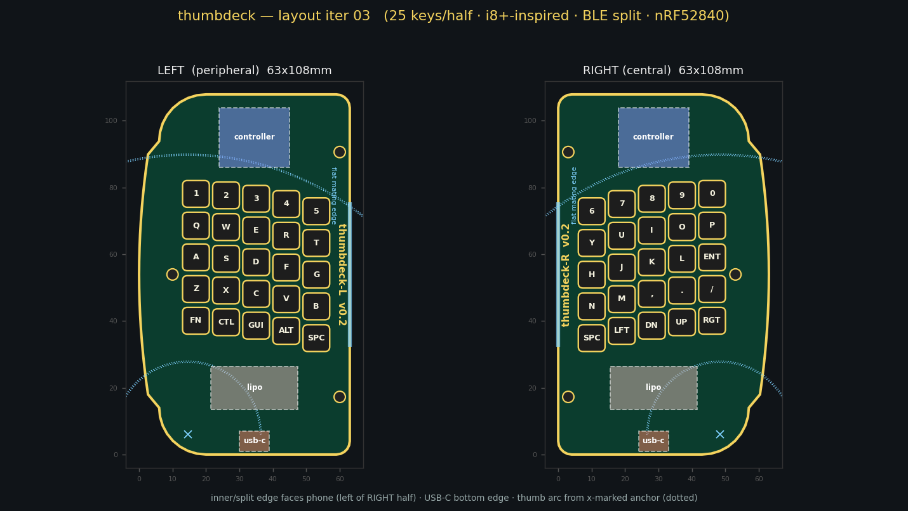
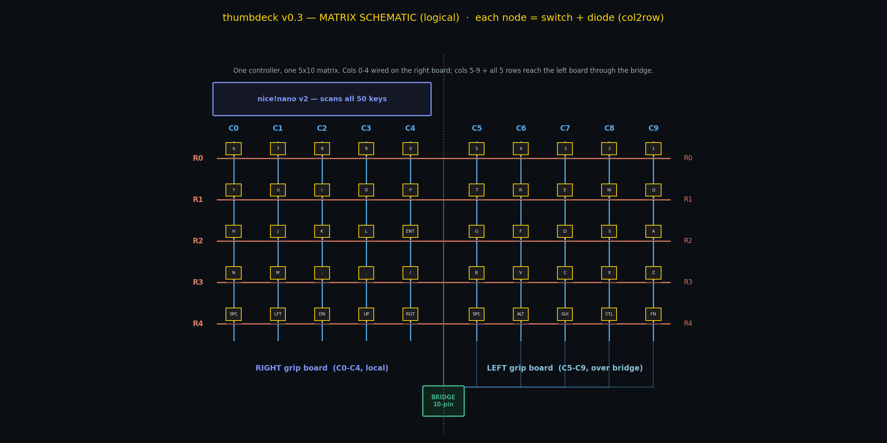
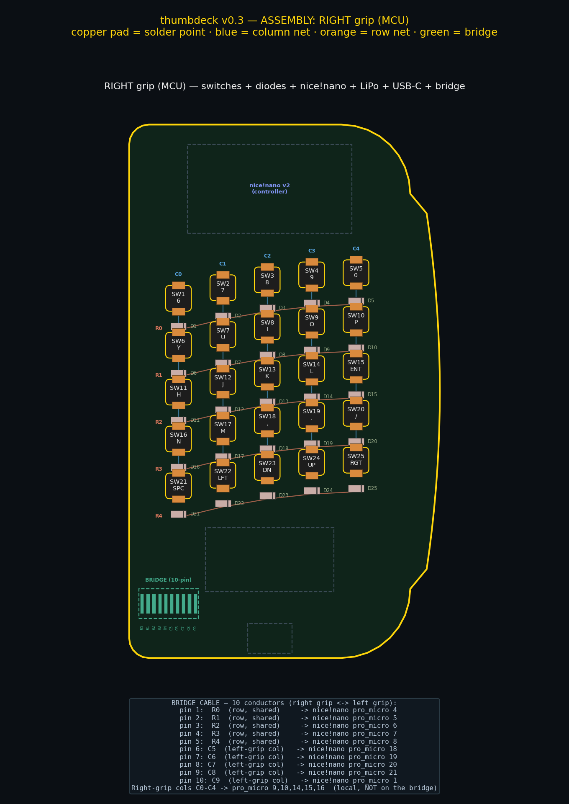
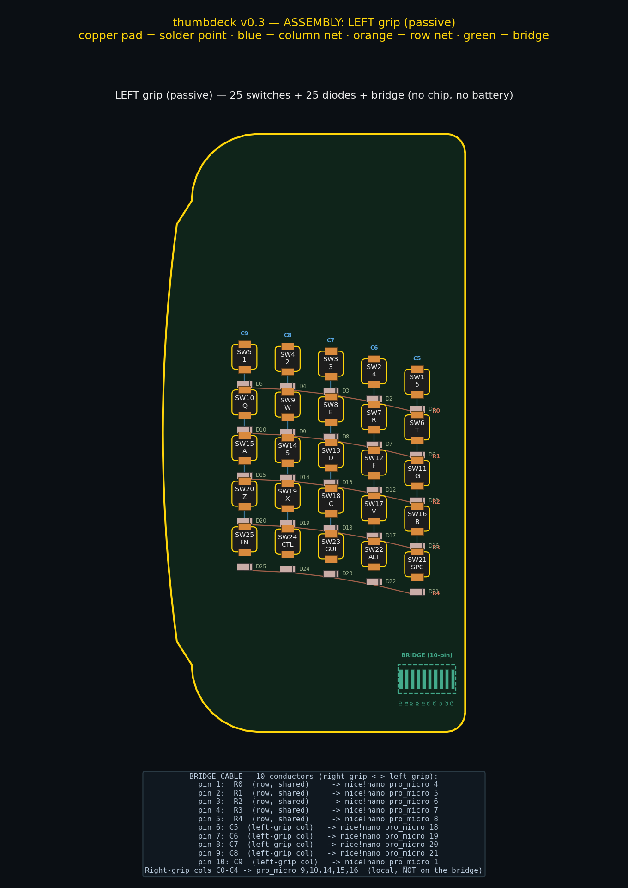
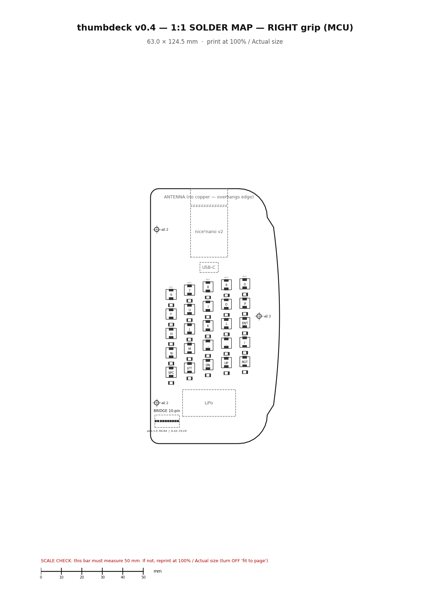

# thumbdeck — custom wireless split thumb keyboard

A two-piece, **wireless, rechargeable**, thumb-typed keyboard. Two grip-shaped
PCBs clamp on either side of a phone like a **Backbone One**, reproducing an
**i8+-inspired** QWERTY split down the middle. **One nRF52840** (nice!nano v2)
in the right grip runs the whole thing over **ZMK**; the left grip is a passive
matrix wired across the telescoping bridge.



> **This is a design handoff, not a finished board.** Layout, firmware, BOM and
> docs are complete and graded (**v0.4 — functional 27/27, visual 9/9, PASS**).
> Two things you must finish before a fab order — a **datasheet-verified switch
> footprint** and **copper routing** — are called out in [Step 1](#step-1--order-the-pcbs)
> and gated in [`docs/design-review.md`](docs/design-review.md).

---

## Contents

- [At a glance](#at-a-glance)
- [The renders](#the-renders) — every drawing, captioned
- [Parts list (BOM)](#parts-list-bom) — everything you buy
- [Tools you'll need](#tools-youll-need)
- **Build guide**
  - [Step 1 — Order the PCBs](#step-1--order-the-pcbs)
  - [Step 2 — Solder & assemble](#step-2--solder--assemble)
  - [Step 3 — Bring-up (power-on checks)](#step-3--bring-up-power-on-checks)
  - [Step 4 — Flash the firmware](#step-4--flash-the-firmware)
  - [Step 5 — Pair & test](#step-5--pair--test)
- [How it works](#how-it-works)
- [Status & grading](#status--grading)
- [Reproduce the design loop](#reproduce-the-design-loop)
- [License](#license)

---

## At a glance

| | value |
|---|---|
| Per-grip board | **63 × 124 mm**, 25 keys (5×5), D-shaped grip |
| Controller | **one nice!nano v2** (nRF52840), vertical at top; **antenna overhangs the top edge** |
| Left grip | **passive** 5×5 matrix, wired over the bridge (10 conductors, shielded flex) |
| Firmware | ZMK single non-split shield `thumbdeck` on `nice_nano_v2`; 8 ms debounce |
| Matrix | single 5×10, `col2row`, 1N4148W diodes; ext. row pull-downs + column series R |
| Wireless | BLE, or USB-C wired HID — one device, no inter-half pairing |
| Power | one LiPo, one USB-C charge (mind the 1C charge note) |
| Fabrication | JLCPCB, 1.6 mm FR-4, HASL — two distinct boards (right = MCU, left = passive) |

> **Architecture note (v0.3):** this replaces v0.2's two-controller BLE split with
> a single controller + a wired bridge — how real Backbone-style controllers
> actually work. One battery, one charge, half the BOM, simpler firmware.
> Rationale in [`docs/design-decisions.md`](docs/design-decisions.md).

---

## The renders

Everything below is generated from one parametric model
([`hardware/scripts/deck.py`](hardware/scripts/deck.py)); regenerate any of it
with the [design loop](#reproduce-the-design-loop).

### Final layout — both grips


Left grip (passive) mirrors the right; only the right grip carries electronics.
Left field is `1-5 / QWERT / ASDFG / ZXCVB`; right field is `67890 / YUIOP /
HJKL-ENT / NM,./` plus an arrow cluster. This is the visual + functional PASS
render (`renders/iter_06.png`).

### Fabrication view — keep-outs by role


Right grip keep-outs: **antenna** (overhanging the top edge, no copper under it),
**controller** (nice!nano, vertical), **USB-C** (access gap), **LiPo** (bottom,
far from the antenna) and the **bridge connector** (inner-bottom). Left grip:
bridge connector only.

### Matrix schematic — how the keys are wired



One 5 row × 10 column matrix, `col2row`, one 1N4148W diode per key. Columns 0–4
are the right grip (local to the MCU); columns 5–9 are the left grip (reached over
the bridge); rows 0–4 are shared across both grips.

### Assembly / solder maps — where each part goes

Right grip (the MCU board):



Left grip (passive):



These call out every switch + diode position, the diode orientation (cathode band
toward the row net), the nice!nano pads, the LiPo pads, and the **10-pin bridge
connector pinout** (5 shared rows + 5 left-grip columns).

### 1:1 printable solder map



[**`renders/thumbdeck_soldermap.pdf`**](renders/thumbdeck_soldermap.pdf) prints at
**true 1:1 on A4** (verified 210 × 297 mm). Print at 100 % / "actual size" (no
"fit to page"), check the ruler on the sheet, then lay your real switches and the
nice!nano directly on it to sanity-check the footprint before you commit parts.

---

## Parts list (BOM)

Full BOM in [`docs/bill-of-materials.md`](docs/bill-of-materials.md). 50 keys total
(25/grip), **one** controller, **one** battery.

### Core

| Item | Part | Qty | Notes |
|---|---|---|---|
| Tact switch | Xiaoyztan 5×5×1.5 mm 4-terminal SMD | 50 (+spares) | Internally 2-terminal SPST. **Meter the pin pairing** — footprint is `TODO(user)`. |
| Diode | 1N4148W SOD-123 | 50 | One per key, `col2row`, cathode band toward the row net, same orientation on both grips. |
| **Controller** | **nice!nano v2** (nRF52840) | **1** | ~18 usable GPIO; BLE + USB-C + onboard LiPo charging. Right grip only. |
| **LiPo cell** | protected, **≥200 mAh** (or a 100 mAh cell rated for 1C — see charge note) | **1** | Right grip only. Confirm it fits the shell. |
| **Bridge connector** | 10-pin FPC/JST (×2) + shielded flex ribbon | 1 set | Right ↔ left grip through the telescoping bridge. |
| Power switch | slide SPST (optional) | 1 | In line with the cell, right grip. |
| M2 hardware | screws + heat-set inserts / standoffs | ~6 | 3 mount holes per grip → clamp shell. |
| PCB | `thumbdeck_right` (MCU) + `thumbdeck_left` (passive), 1.6 mm HASL | ~5 each | JLCPCB. **Two distinct boards.** |
| Keycaps / tops | TBD | 50 | `TODO(user)` — required over bare plungers. |

### Bridge signal integrity & protection (required, not optional)

Scanning a matrix over a long, flexing cable needs hardening — this is the design's
main electrical risk (see [`docs/matrix-and-diodes.md`](docs/matrix-and-diodes.md)).

| Item | Part | Qty | Notes |
|---|---|---|---|
| Row **pull-down** resistors | 4.7 kΩ 0402 | 5 | External, at the MCU on each row — the nRF's internal ~13 kΩ is too weak over the cable (stops stale-high phantom presses). |
| Column **series** resistors | 100–330 Ω 0402 | 10 | In series with each driven column — slow edges, kill ringing/crosstalk. |
| **TVS** diode array | SP3051 / USBLC6 (low-C) | 2–3 | ESD clamp on the 10 exposed bridge conductors + USB data lines. |
| Bridge cable | shielded / ground-interleaved FFC, flex-rated | 1 | Shield/GND to chassis; strain-relieve both ends. |

### Optional variant

| Item | Part | Qty | Notes |
|---|---|---|---|
| Bridge I/O expander | MCP23017 (I²C) | 1 | Shrinks the bridge to 4 wires. **Caveat:** I²C is *worse* over a long flexing cable — prefer a 74HC165 shift register or a UART link if you must reduce conductors. |

---

## Tools you'll need

- Fine-tip **soldering iron** (+ solder, flux) or a hot-air / reflow setup for the
  0402 passives and SOD-123 diodes.
- **Multimeter** with continuity mode — used at *two* points: metering the switch
  pin pairing before you commit the footprint, and the bring-up continuity checks.
- **Bench power supply** with adjustable current limit (for the ~50 mA bring-up
  step) — a lab supply or any current-limited USB source.
- Tweezers, flush cutters, and a **USB-C cable** for flashing/charging.
- **KiCad** (free) to finish the footprint + routing before ordering.

---

# Build guide

The path is: **finish the two open gates → order boards → solder → bring-up →
flash → pair → test.** The design stops short of gerbers on purpose — it doesn't
fabricate what it can't verify. Full detail in
[`docs/assembly.md`](docs/assembly.md).

## Step 1 — Order the PCBs

Before boards can be ordered you must close two `TODO(user)` gates. **Do not skip
these** — they're the difference between a working board and 5× scrap:

1. **Verify the switch footprint.** Put a multimeter in continuity mode across the
   switch's 4 legs and confirm *which two pairs are internally shorted* (same-side
   or diagonal — it changes the footprint **and** the matrix wiring). Build the
   footprint in KiCad and save it to `hardware/footprints/`. See
   [`hardware/footprints/README.md`](hardware/footprints/README.md). Cross-check
   against the [1:1 solder map](renders/thumbdeck_soldermap.pdf) by laying a real
   switch on the printout.
2. **Route the copper.** Open the generated boards in KiCad —
   `hardware/kicad/generated/thumbdeck_right.kicad_pcb` (MCU) and
   `thumbdeck_left.kicad_pcb` (passive) — assign the verified footprint, draw the
   schematic, route the matrix + the bridge connector, and **pass DRC + ERC**.
   See [`hardware/kicad/README.md`](hardware/kicad/README.md).

The generated board already carries the correct **outline, placement, keep-outs,
mount + bridge features** (`.kicad_pcb`, `.dxf` outline and `placement.csv` in
`hardware/kicad/generated/`), so routing is the remaining work — not layout.

Then order from **JLCPCB** (or any fab):

- Export gerbers from KiCad after DRC passes.
- Board spec: **1.6 mm FR-4, HASL** (HASL is fine — SMD legs, no bare carbon pads).
- Order **both** `thumbdeck_right` **and** `thumbdeck_left` — they are *not* the
  same board (right = MCU, left = passive).

## Step 2 — Solder & assemble

Use the [assembly renders](#assembly--solder-maps--where-each-part-goes) and the
[1:1 solder map](renders/thumbdeck_soldermap.pdf) as you go.

**Both grips:**
- Reflow/hand-solder the **25 switches** and **25 diodes** (SOD-123). Keep every
  diode's **cathode band toward the row net** (`col2row`), same orientation on both
  grips.
- Place the **row pull-downs** and **column series resistors** at the MCU.

**Right grip only (the MCU board):**
- Solder the **nice!nano v2** to its castellated pads (top keep-out).
- Wire the **LiPo** to `BAT+ / BAT-` — **observe polarity.**
- (Optional) slide power switch in line with the cell.
- Add the **TVS** array on the bridge conductors + USB data lines.

**Bridge:**
- Solder the **10-pin bridge connector** at the inner-bottom corner of each grip.
- Run the shielded flex (5 shared rows + 5 left-grip columns) through the bridge;
  strain-relieve both ends. *(Or, expander variant: MCP23017 in the left grip + a
  4-wire cable.)*

## Step 3 — Bring-up (power-on checks)

**Do this before flashing** — catch shorts before they cook a component. Expected
values in [`docs/assembly.md`](docs/assembly.md#15-bring-up):

1. **Continuity, power off.** BAT+ ↔ GND: **expect open** (no short). Buzz all 10
   bridge conductors end-to-end: continuity each, no shorts between adjacent pins.
2. **First power (bench supply, current-limited ~50 mA).** Apply 3.7 V at BAT+.
   **Expect a few mA** — *not* the limit. Slams to the limit → short; stop.
3. **Rail check.** nice!nano 3.3 V rail: **expect 3.3 V ±5 %**.
4. **Idle current.** After flashing, idle/advertising should draw **single-digit
   mA** (BLE), dropping toward µA in deep sleep. Tens of mA idle = mis-wired.
5. **Charge check.** Plug USB-C: expect the charge LED per the nice!nano docs; the
   cell should warm only slightly. **Never leave it charging unattended.**
6. **Matrix continuity.** Press a key, buzz its column pad → row pad through the
   diode: continuity **one way only**.

Only proceed once 1–3 pass.

## Step 4 — Flash the firmware

One image — there is no second controller.

- **Push this repo.** GitHub Actions ([`.github/workflows/build.yml`](.github/workflows/build.yml))
  builds a single `thumbdeck` firmware for `nice_nano_v2`.
- Download the `thumbdeck-*.uf2` artifact.
- **Double-tap reset** on the nice!nano → it mounts as a USB drive → drag the
  `.uf2` on. Done.

## Step 5 — Pair & test

**Pair:**
- Power the keyboard; pair the host to the advertised **"thumbdeck"** device.
  (No inter-half pairing — the left grip is wired, not a BLE peer.)
- Wired option: plug the right grip into the host over USB-C for wired HID.
- Re-pair / clear bonds: **Fn + `BT_CLR`**, then `BT_SEL 0/1/2` for a profile.

**Test:**
- Type across both grips — all **50 keys** should register and match the legends.
  A dead **column** on the *left* grip → suspect a bridge conductor; a dead **row**
  affects *both* grips (rows are shared).
- Confirm the single **battery level** reports on the host.
- Confirm the **Fn layer** (`Fn` = left outer thumb) + `BT_*`.
- Hold several keys at once — the diodes should kill ghosting.

---

## How it works

```
   LEFT grip (passive)                 RIGHT grip (MCU)
   25 switches + diodes  ── bridge ──  nRF52840 + LiPo + USB-C  ⇄ host (BLE or USB-C)
   (no chip, no battery)   cable       scans all 50 keys
```

- **One matrix, no split.** A single 5×10 matrix scanned by one nRF52840. Columns
  0–4 = right grip (local); columns 5–9 = left grip (over the bridge); rows 0–4
  shared. No ZMK BLE split, no `col-offset`. See
  [`docs/matrix-and-diodes.md`](docs/matrix-and-diodes.md).
- **Pins (nice!nano `&pro_micro`):** rows `4 5 6 7 8`; right cols `9 10 14 15 16`;
  left cols `18 19 20 21 1`; spare `0 2 3` (2/3 = I²C for the expander option).
- **Power:** one LiPo on the nice!nano's onboard BQ24075 charger, one USB-C, one
  charge session. **Charge-current note:** the default ~100 mA into a 100 mAh cell
  is **1C** (aggressive) — use a protected 1C cell, a ≥200 mAh cell, or change the
  PROG resistor. [`docs/connectivity-and-power.md`](docs/connectivity-and-power.md).
- **Antenna:** the nice!nano is vertical at the top with its antenna **overhanging
  the top edge** (no copper under the RF path), LiPo far away. Expect reduced range
  vs. an open board (phone + hand detune it).

**More docs:** [design decisions](docs/design-decisions.md) ·
[connectivity & power](docs/connectivity-and-power.md) ·
[matrix & diodes](docs/matrix-and-diodes.md) ·
[EE design review + FMEA](docs/design-review.md) ·
[i8+ reference notes](docs/reference-notes.md)

---

## Status & grading

**v0.4 — converged & graded: PASS.** An autonomous generate → render → grade loop
drives the layout; v0.4 folds a professional **EE design review** into the grade,
so the antenna keep-out, bridge signal-integrity, charge current and the human fab
gates are **enforced checks**, not just reminders. Details in
[`renders/GRADING.md`](renders/GRADING.md).

```
FUNCTIONAL : 100.0%  (27/27)  hard-fails: none   -> PASS
VISUAL     : 9/9 checklist items                 -> PASS
OVERALL    : *** PASS ***
```

> **What the grade proves — and doesn't.** It covers **geometry + config/doc
> structure**. It is **not** electrical sign-off: no compile, no DRC/ERC, no RF
> sim. Passing is necessary, not sufficient. Before ordering boards, these
> human-verified gates must pass ([`docs/design-review.md`](docs/design-review.md)):
>
> 1. **Schematic** drawn, netlist generated.
> 2. Layout routed, passes **DRC** and **ERC**.
> 3. Datasheet-verified switch footprint (**meter** the pin pairing).
> 4. **ZMK CI build green** (`.github/workflows/build.yml`); no `pro_micro` pin collisions.
> 5. Antenna keep-out + bridge SI hardening + charge current confirmed on the real board.

---

## Reproduce the design loop

```bash
cd hardware/scripts
python3 layout_gen.py   --iter 6    # render both grips  -> renders/iter_06.png
python3 grade.py        --iter 6    # objective functional grade (27 checks)
python3 final_grade.py  --iter 6    # combined functional + visual verdict
python3 matrix_map.py               # legends <-> ZMK keymap consistency (50/50)
python3 gen_kicad.py                # emit .kicad_pcb + DXF + placement CSV
python3 render_fab.py               # fabrication-view render
python3 render_wiring.py            # matrix schematic + assembly/solder maps
python3 render_soldermap.py         # 1:1 A4 printable solder map (PDF)
```

Requires Python 3 + `matplotlib` (no KiCad needed to render or generate the board
file). Repo layout:

```
docs/            design decisions, connectivity/power, matrix, BOM, assembly,
                 EE design review, i8+ reference
hardware/
  scripts/       deck.py (geometry) · layout_gen.py + render_*.py (renders) ·
                 grade.py + final_grade.py (grading) · gen_kicad.py (board) ·
                 matrix_map.py (keymap-consistency aid)
  kicad/         manual KiCad workflow + generated/ outline + placement
  footprints/    datasheet-verified switch footprint (TODO gate)
renders/         iter_NN.png loop history · production.png · fab_view.png ·
                 wiring_schematic.png · wiring_assembly_{left,right}.png ·
                 soldermap PDF + preview · GRADING.md
firmware/
  zmk-config/    single ZMK shield "thumbdeck" + build.yaml + CI
.github/         GitHub Actions ZMK build
```

---

## License

MIT — see [LICENSE](LICENSE).
